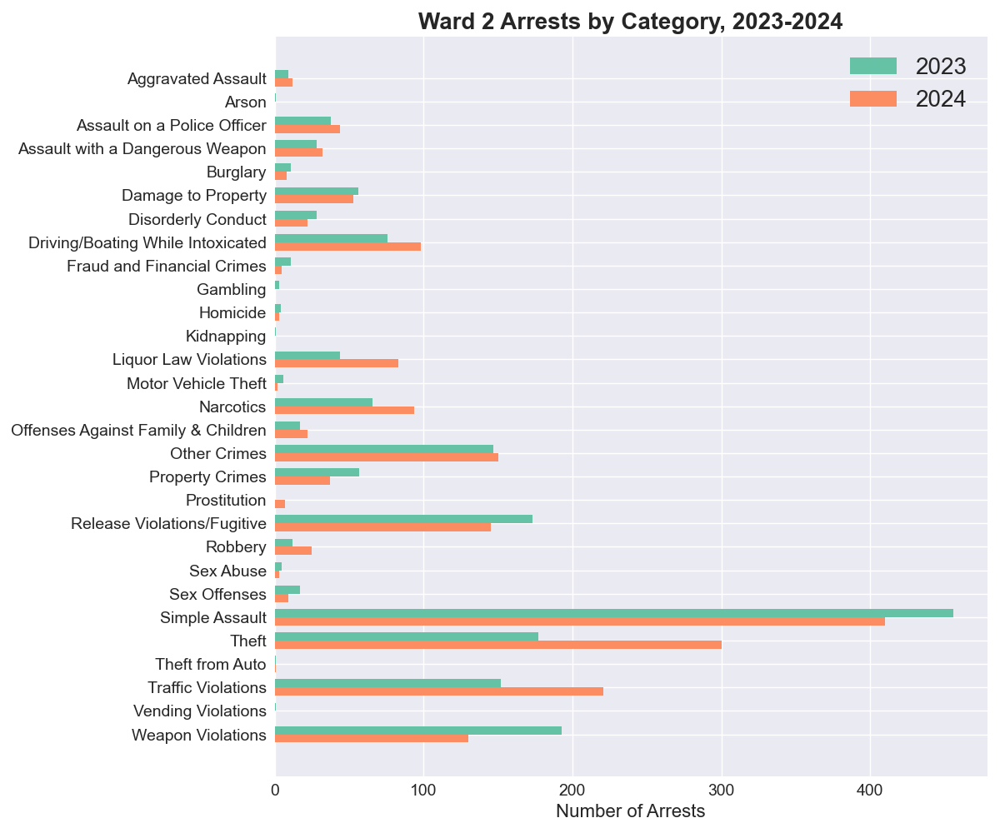
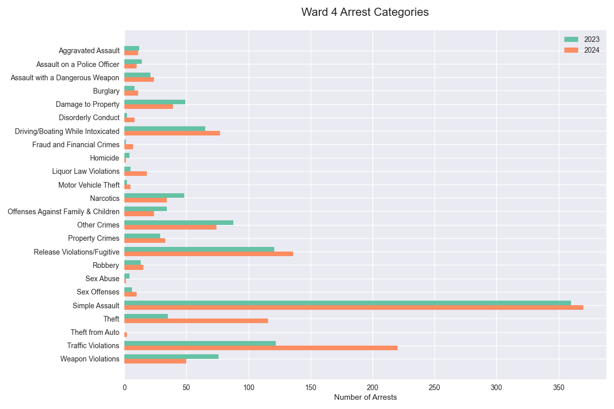
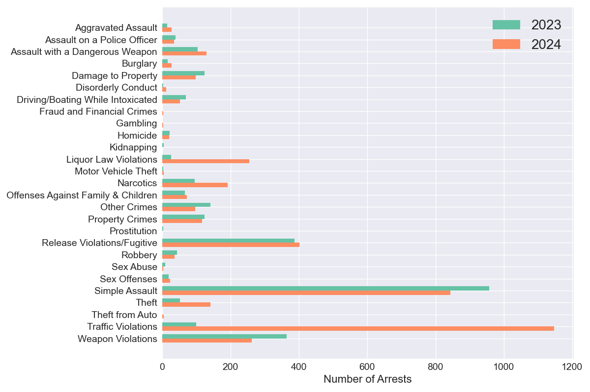
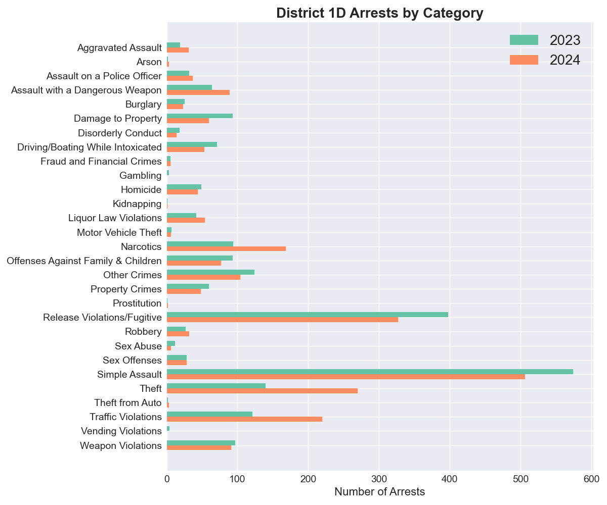
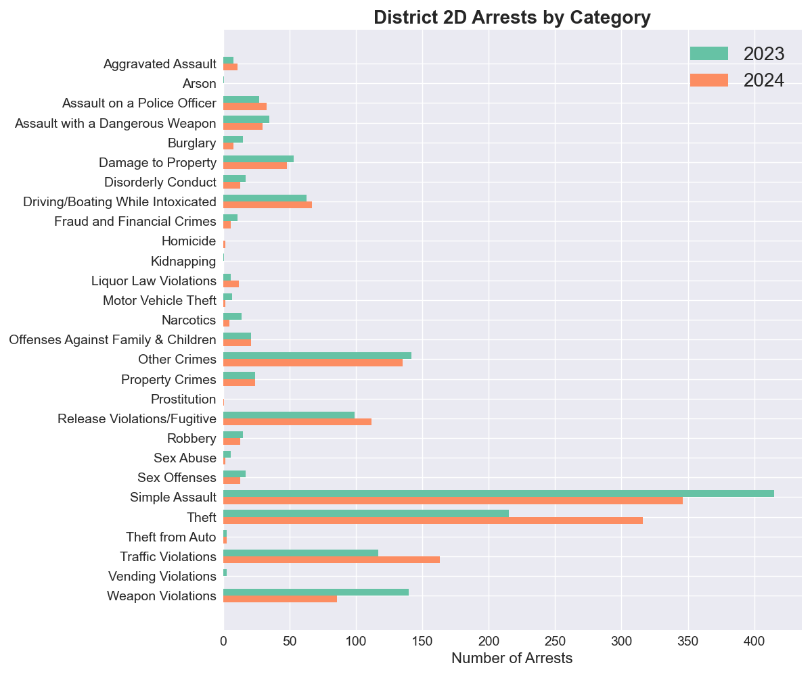
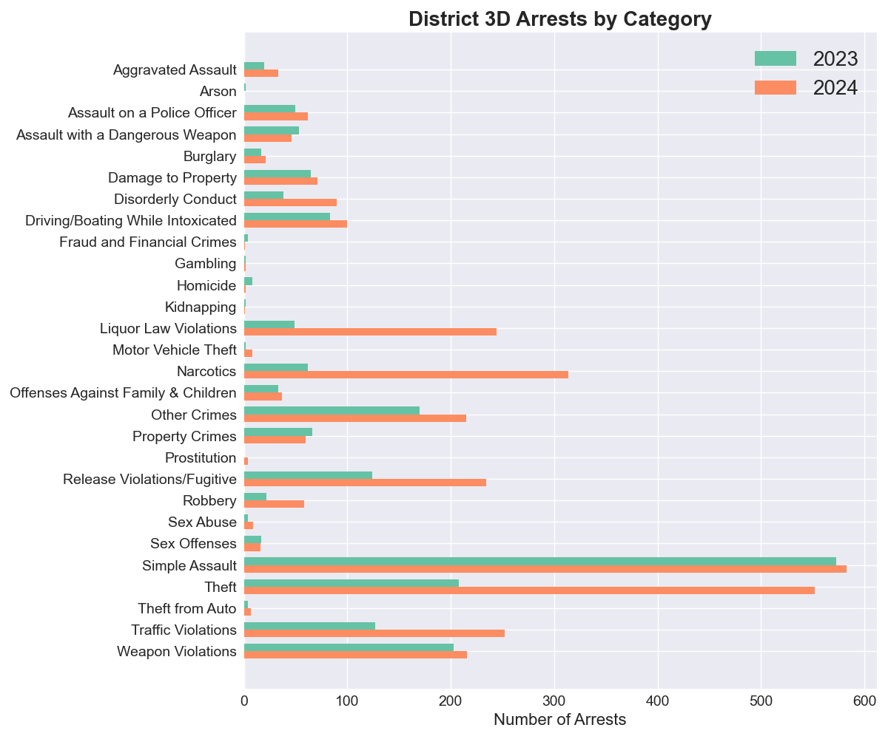
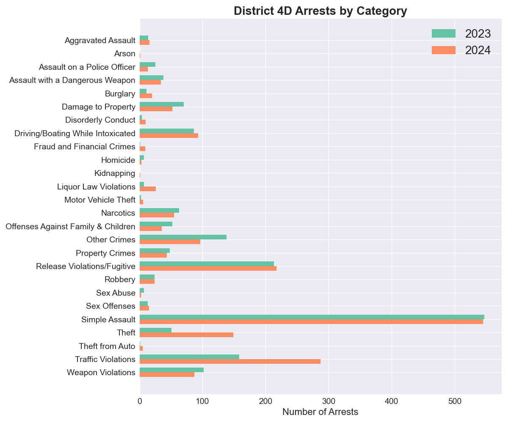
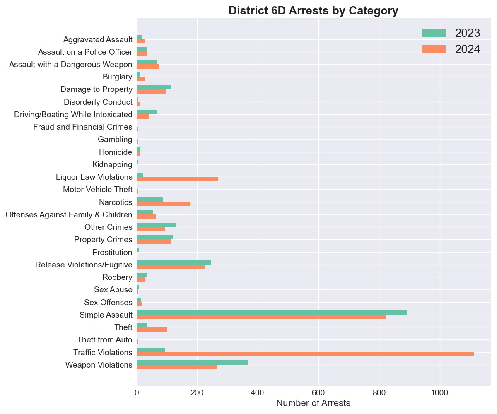
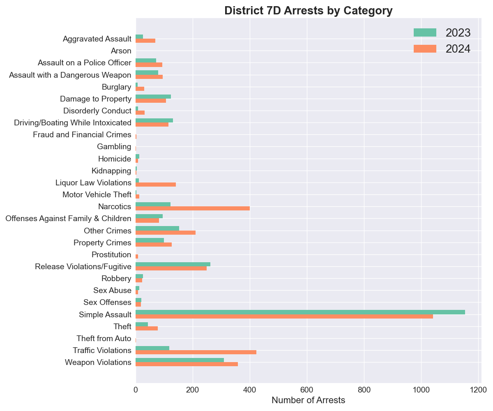

# DC Metropolitan Police Department Adult Arrest Trends, 2023-2024

## Background

MPD recently made its annual public release of adult arrest data, covering 19,263 arrests in 2024. This data represents the first full year of data available since Chief Smith took office in November of 2023, and reveals major changes in policing strategy over that timeframe. This report covers data for the entire city, and also includes an appendix with tables and charts for each Ward and Police District. 

This adult arrest data is taken from the Open Data DC website. DC resident and data scientist Taylor Terry maintains an archive of this and other DC public data at https://github.com/taylorterry3/dc-public-data. Taylor can be reached at taylor.terry@gmail.com.

### Citywide Changes in Arrest Patterns

in 2024 MPD made19,263 adult arrests citywide, a +27% change from 15,223 arrests in 2023 and a +30% change from the 2021-2023 average of 14,861. The increase in arrests was concentrated in Wards 1, 7, and 8. These wards each saw more than 1,000 additional arrests, while the next biggest gain was 212 additional arrests in Ward 5.

| Ward | 2023 | 2024 | Change | Percent Change |
|------|------:|------:|--------:|---------------:|
| 1 | 1,699 | 2,820 | +1,121 | +66% |
| 2 | 1,790 | 1,916 | +126 | +7% |
| 3 | 466 | 477 | +11 | +2% |
| 4 | 1,119 | 1,296 | +177 | +16% |
| 5 | 2,414 | 2,626 | +212 | +9% |
| 6 | 1,578 | 1,723 | +145 | +9% |
| 7 | 2,798 | 4,017 | +1,219 | +44% |
| 8 | 3,359 | 4,388 | +1,029 | +31% |

Much of this increase in arrests was driven by 2,000 additional arrests for Traffic Violations, 868 more for Theft, 814 more for Narcotics, and 743 more for Liquor Law Violations. 

| Arrest Category | 2023 | 2024 | Change | % Change |
|----------------|------:|------:|--------:|----------:|
| Traffic Violations | 898 | 2,898 | +2,000 | +223% |
| Theft | 870 | 1,738 | +868 | +100% |
| Narcotics | 529 | 1,343 | +814 | +154% |
| Liquor Law Violations | 164 | 907 | +743 | +453% |
| All Other Categories | 12,762 | 12,377 | -385 | -3% |

\newpage

This crosstab shows the percentage change for these arrest categories by Ward from 2023 to 2024. Note especially the roughly tenfold increase in Liquor Law Violation arrests in Wards 7 and 8, as well as a similarly large increase in Traffic Violation arrests in Ward 7. Ward 1 saw fivefold increases in Liquor Law Violation and Narcotics arrests, while Ward 5 saw a similar rate of increase in Liquor Law Violation Arrests. 

|Category| W1 | W2 | W3 | W4 | W5 | W6 | W7 | W8 |
|--------|---:|---:|---:|---:|---:|---:|---:|----:|
| Traffic | +108% | +45% | +106% | +80% | +129% | +137% | +1047% | +211% |
| Theft | +176% | +69% | +16% | +231% | +56% | +79% | +173% | +89% |
| Narcotics | +400% | +42% | +33% | -29% | +113% | +181% | +100% | +229% |
| Liquor | +433% | +89% | +100% | +260% | +470% | +140% | +844% | +1369% |
| Other | +23% | -10% | -7% | 0% | -13% | -11% | -10% | +4% |

### Productivity per Officer

MPD reported having 3,282 sworn officers in 2024, meaning that 19,263 arrests represents 5.9 arrests per sworn officer for the year. This is a substantial increase from the 2021-2023 average of 4.3 arrests per officer per year, but is far from a return to the 2016-2019 average of 7.7 arrests per officer. 

The chart below shows the trend in arrests per sworn officer per monthover time, as well as the trend in stops per officer for periods when this data is available. MPD stops data currently runs only from 2019 through June of 2024. The release schedule is irregular and MPD has historically refused to release this data in response to FOIA requests, and so it is unclear when the rest of the 2024 data will be available. 

\newpage
### Arrests by Category

The table below shows the number of arrests by category citywide for the years 2023 and 2024, sorted by percentage change. Of particular note is that DWI arrests remained flat despite a greater than threefold increase in arrests for Traffic Violations. 

| Arrest Category | 2023 | 2024 | Change | % Change |
|----------------|------:|------:|--------:|----------:|
| Liquor Law Violations | 164 | 907 | +743 | +453% |
| Traffic Violations | 898 | 2,898 | +2,000 | +223% |
| Narcotics | 529 | 1,343 | +814 | +154% |
| Theft from Auto | 14 | 30 | +16 | +114% |
| Prostitution | 10 | 20 | +10 | +100% |
| Theft | 870 | 1,738 | +868 | +100% |
| Aggravated Assault | 122 | 236 | +114 | +93% |
| Disorderly Conduct | 106 | 195 | +89 | +84% |
| Motor Vehicle Theft | 31 | 50 | +19 | +61% |
| Gambling | 5 | 7 | +2 | +40% |
| Fraud and Financial Crimes | 25 | 34 | +9 | +36% |
| Burglary | 113 | 148 | +35 | +31% |
| Robbery | 181 | 223 | +42 | +23% |
| Assault with a Dangerous Weapon | 398 | 433 | +35 | +9% |
| Assault on a Police Officer | 298 | 320 | +22 | +7% |
| Release Violations/Fugitive | 1,568 | 1,610 | +42 | +3% |
| Arson | 6 | 6 | +0 | 0% |
| Driving/Boating While Intoxicated | 606 | 604 | -2 | 0% |
| Property Crimes | 493 | 491 | -2 | 0% |
| Sex Offenses | 128 | 124 | -4 | -3% |
| Other Crimes | 1,043 | 976 | -67 | -6% |
| Offenses Against Family & Children | 391 | 361 | -30 | -8% |
| Simple Assault | 5,002 | 4,570 | -432 | -9% |
| Weapon Violations | 1,421 | 1,286 | -135 | -10% |
| Homicide | 96 | 83 | -13 | -14% |
| Damage to Property | 627 | 527 | -100 | -16% |
| Sex Abuse | 54 | 35 | -19 | -35% |
| Kidnapping | 16 | 8 | -8 | -50% |
| Vending Violations | 8 | 0 | -8 | -100% |

This chart presents the same data as above in a visual format, sorted by arrest category.

\newpage

\newpage
# Appendix 1: Data by Ward

## Ward 1

| Arrest Category | 2023 | 2024 | Change | % Change |
|----------------|------:|------:|--------:|----------:|
| Motor Vehicle Theft | 1 | 7 | +6 | +600% |
| Liquor Law Violations | 39 | 208 | +169 | +433% |
| Narcotics | 53 | 265 | +212 | +400% |
| Theft | 185 | 510 | +325 | +176% |
| Disorderly Conduct | 31 | 80 | +49 | +158% |
| Theft from Auto | 4 | 9 | +5 | +125% |
| Traffic Violations | 106 | 220 | +114 | +108% |
| Robbery | 23 | 47 | +24 | +104% |
| Release Violations/Fugitive | 128 | 235 | +107 | +84% |
| Sex Abuse | 4 | 7 | +3 | +75% |
| Aggravated Assault | 16 | 26 | +10 | +62% |
| Burglary | 17 | 24 | +7 | +41% |
| Weapon Violations | 150 | 189 | +39 | +26% |
| Assault on a Police Officer | 43 | 51 | +8 | +19% |
| Damage to Property | 55 | 62 | +7 | +13% |
| Property Crimes | 35 | 39 | +4 | +11% |
| Simple Assault | 454 | 504 | +50 | +11% |
| Driving/Boating While Intoxicated | 67 | 73 | +6 | +9% |
| Other Crimes | 170 | 176 | +6 | +4% |
| Gambling | 2 | 2 | +0 | 0% |
| Offenses Against Family & Children | 32 | 28 | -4 | -12% |
| Assault with a Dangerous Weapon | 54 | 40 | -14 | -26% |
| Sex Offenses | 20 | 14 | -6 | -30% |
| Fraud and Financial Crimes | 4 | 2 | -2 | -50% |
| Kidnapping | 2 | 1 | -1 | -50% |
| Homicide | 3 | 1 | -2 | -67% |
| Arson | 1 | 0 | -1 | -100% |
| Prostitution | 0 | 0 | +0 | N/A |
| Vending Violations | 0 | 0 | +0 | N/A |

\newpage
## Ward 2

| Arrest Category | 2023 | 2024 | Change | % Change |
|----------------|------:|------:|--------:|----------:|
| Robbery | 12 | 25 | +13 | +108% |
| Liquor Law Violations | 44 | 83 | +39 | +89% |
| Theft | 177 | 300 | +123 | +69% |
| Traffic Violations | 152 | 221 | +69 | +45% |
| Narcotics | 66 | 94 | +28 | +42% |
| Aggravated Assault | 9 | 12 | +3 | +33% |
| Offenses Against Family & Children | 17 | 22 | +5 | +29% |
| Driving/Boating While Intoxicated | 76 | 98 | +22 | +29% |
| Assault on a Police Officer | 38 | 44 | +6 | +16% |
| Assault with a Dangerous Weapon | 28 | 32 | +4 | +14% |
| Other Crimes | 147 | 150 | +3 | +2% |
| Theft from Auto | 1 | 1 | +0 | 0% |
| Damage to Property | 56 | 53 | -3 | -5% |
| Simple Assault | 456 | 410 | -46 | -10% |
| Release Violations/Fugitive | 173 | 145 | -28 | -16% |
| Disorderly Conduct | 28 | 22 | -6 | -21% |
| Homicide | 4 | 3 | -1 | -25% |
| Burglary | 11 | 8 | -3 | -27% |
| Weapon Violations | 193 | 130 | -63 | -33% |
| Property Crimes | 57 | 37 | -20 | -35% |
| Sex Abuse | 5 | 3 | -2 | -40% |
| Sex Offenses | 17 | 9 | -8 | -47% |
| Fraud and Financial Crimes | 11 | 5 | -6 | -55% |
| Motor Vehicle Theft | 6 | 2 | -4 | -67% |
| Arson | 1 | 0 | -1 | -100% |
| Gambling | 3 | 0 | -3 | -100% |
| Kidnapping | 1 | 0 | -1 | -100% |
| Vending Violations | 1 | 0 | -1 | -100% |
| Prostitution | 0 | 7 | +7 | N/A |

\newpage
## Ward 3

| Arrest Category | 2023 | 2024 | Change | % Change |
|----------------|------:|------:|--------:|----------:|
| Assault on a Police Officer | 4 | 11 | +7 | +175% |
| Aggravated Assault | 2 | 5 | +3 | +150% |
| Traffic Violations | 17 | 35 | +18 | +106% |
| Disorderly Conduct | 1 | 2 | +1 | +100% |
| Liquor Law Violations | 1 | 2 | +1 | +100% |
| Sex Abuse | 1 | 2 | +1 | +100% |
| Sex Offenses | 5 | 7 | +2 | +40% |
| Narcotics | 3 | 4 | +1 | +33% |
| Driving/Boating While Intoxicated | 16 | 20 | +4 | +25% |
| Theft | 92 | 107 | +15 | +16% |
| Release Violations/Fugitive | 40 | 43 | +3 | +8% |
| Weapon Violations | 12 | 12 | +0 | 0% |
| Other Crimes | 36 | 34 | -2 | -6% |
| Offenses Against Family & Children | 13 | 12 | -1 | -8% |
| Damage to Property | 21 | 19 | -2 | -10% |
| Simple Assault | 158 | 133 | -25 | -16% |
| Assault with a Dangerous Weapon | 16 | 12 | -4 | -25% |
| Robbery | 9 | 6 | -3 | -33% |
| Theft from Auto | 3 | 2 | -1 | -33% |
| Property Crimes | 5 | 3 | -2 | -40% |
| Burglary | 6 | 3 | -3 | -50% |
| Motor Vehicle Theft | 2 | 1 | -1 | -50% |
| Arson | 1 | 0 | -1 | -100% |
| Vending Violations | 2 | 0 | -2 | -100% |
| Fraud and Financial Crimes | 0 | 1 | +1 | N/A |
| Gambling | 0 | 0 | +0 | N/A |
| Homicide | 0 | 1 | +1 | N/A |
| Kidnapping | 0 | 0 | +0 | N/A |
| Prostitution | 0 | 0 | +0 | N/A |

\newpage
## Ward 4

| Arrest Category | 2023 | 2024 | Change | % Change |
|----------------|------:|------:|--------:|----------:|
| Fraud and Financial Crimes | 1 | 7 | +6 | +600% |
| Disorderly Conduct | 2 | 8 | +6 | +300% |
| Liquor Law Violations | 5 | 18 | +13 | +260% |
| Theft | 35 | 116 | +81 | +231% |
| Motor Vehicle Theft | 2 | 5 | +3 | +150% |
| Traffic Violations | 122 | 220 | +98 | +80% |
| Sex Offenses | 6 | 10 | +4 | +67% |
| Burglary | 8 | 11 | +3 | +38% |
| Driving/Boating While Intoxicated | 65 | 77 | +12 | +18% |
| Robbery | 13 | 15 | +2 | +15% |
| Assault with a Dangerous Weapon | 21 | 24 | +3 | +14% |
| Property Crimes | 29 | 33 | +4 | +14% |
| Release Violations/Fugitive | 121 | 136 | +15 | +12% |
| Simple Assault | 360 | 370 | +10 | +3% |
| Aggravated Assault | 12 | 11 | -1 | -8% |
| Other Crimes | 88 | 74 | -14 | -16% |
| Damage to Property | 49 | 39 | -10 | -20% |
| Assault on a Police Officer | 14 | 10 | -4 | -29% |
| Narcotics | 48 | 34 | -14 | -29% |
| Offenses Against Family & Children | 34 | 24 | -10 | -29% |
| Weapon Violations | 76 | 50 | -26 | -34% |
| Homicide | 4 | 1 | -3 | -75% |
| Sex Abuse | 4 | 1 | -3 | -75% |
| Arson | 0 | 0 | +0 | N/A |
| Gambling | 0 | 0 | +0 | N/A |
| Kidnapping | 0 | 0 | +0 | N/A |
| Prostitution | 0 | 0 | +0 | N/A |
| Theft from Auto | 0 | 2 | +2 | N/A |
| Vending Violations | 0 | 0 | +0 | N/A |

\newpage
## Ward 5

| Arrest Category | 2023 | 2024 | Change | % Change |
|----------------|------:|------:|--------:|----------:|
| Liquor Law Violations | 20 | 114 | +94 | +470% |
| Theft from Auto | 2 | 6 | +4 | +200% |
| Aggravated Assault | 20 | 48 | +28 | +140% |
| Traffic Violations | 163 | 373 | +210 | +129% |
| Narcotics | 77 | 164 | +87 | +113% |
| Fraud and Financial Crimes | 3 | 6 | +3 | +100% |
| Motor Vehicle Theft | 7 | 11 | +4 | +57% |
| Theft | 147 | 229 | +82 | +56% |
| Disorderly Conduct | 17 | 21 | +4 | +24% |
| Driving/Boating While Intoxicated | 94 | 105 | +11 | +12% |
| Robbery | 33 | 36 | +3 | +9% |
| Kidnapping | 2 | 2 | +0 | 0% |
| Offenses Against Family & Children | 45 | 45 | +0 | 0% |
| Release Violations/Fugitive | 247 | 230 | -17 | -7% |
| Assault with a Dangerous Weapon | 61 | 55 | -6 | -10% |
| Sex Offenses | 17 | 15 | -2 | -12% |
| Simple Assault | 833 | 698 | -135 | -16% |
| Weapon Violations | 178 | 143 | -35 | -20% |
| Property Crimes | 80 | 64 | -16 | -20% |
| Burglary | 24 | 19 | -5 | -21% |
| Damage to Property | 103 | 77 | -26 | -25% |
| Homicide | 10 | 7 | -3 | -30% |
| Other Crimes | 172 | 117 | -55 | -32% |
| Assault on a Police Officer | 52 | 35 | -17 | -33% |
| Sex Abuse | 6 | 4 | -2 | -33% |
| Vending Violations | 1 | 0 | -1 | -100% |
| Arson | 0 | 2 | +2 | N/A |
| Gambling | 0 | 0 | +0 | N/A |
| Prostitution | 0 | 0 | +0 | N/A |

\newpage
## Ward 6

| Arrest Category | 2023 | 2024 | Change | % Change |
|----------------|------:|------:|--------:|----------:|
| Narcotics | 47 | 132 | +85 | +181% |
| Liquor Law Violations | 15 | 36 | +21 | +140% |
| Traffic Violations | 78 | 185 | +107 | +137% |
| Arson | 1 | 2 | +1 | +100% |
| Theft | 107 | 192 | +85 | +79% |
| Aggravated Assault | 16 | 28 | +12 | +75% |
| Robbery | 19 | 27 | +8 | +42% |
| Assault with a Dangerous Weapon | 22 | 30 | +8 | +36% |
| Sex Offenses | 19 | 24 | +5 | +26% |
| Weapon Violations | 87 | 92 | +5 | +6% |
| Burglary | 18 | 19 | +1 | +6% |
| Assault on a Police Officer | 30 | 30 | +0 | 0% |
| Disorderly Conduct | 14 | 14 | +0 | 0% |
| Fraud and Financial Crimes | 4 | 4 | +0 | 0% |
| Kidnapping | 1 | 1 | +0 | 0% |
| Motor Vehicle Theft | 5 | 5 | +0 | 0% |
| Property Crimes | 50 | 50 | +0 | 0% |
| Homicide | 37 | 33 | -4 | -11% |
| Release Violations/Fugitive | 156 | 135 | -21 | -13% |
| Simple Assault | 503 | 421 | -82 | -16% |
| Other Crimes | 117 | 97 | -20 | -17% |
| Offenses Against Family & Children | 77 | 62 | -15 | -19% |
| Driving/Boating While Intoxicated | 63 | 46 | -17 | -27% |
| Damage to Property | 75 | 52 | -23 | -31% |
| Theft from Auto | 3 | 2 | -1 | -33% |
| Sex Abuse | 11 | 4 | -7 | -64% |
| Prostitution | 1 | 0 | -1 | -100% |
| Vending Violations | 2 | 0 | -2 | -100% |
| Gambling | 0 | 0 | +0 | N/A |

\newpage
## Ward 7

| Arrest Category | 2023 | 2024 | Change | % Change |
|----------------|------:|------:|--------:|----------:|
| Traffic Violations | 100 | 1,147 | +1,047 | +1047% |
| Liquor Law Violations | 27 | 255 | +228 | +844% |
| Disorderly Conduct | 3 | 12 | +9 | +300% |
| Fraud and Financial Crimes | 1 | 4 | +3 | +300% |
| Theft | 52 | 142 | +90 | +173% |
| Narcotics | 96 | 192 | +96 | +100% |
| Aggravated Assault | 15 | 28 | +13 | +87% |
| Burglary | 17 | 28 | +11 | +65% |
| Assault with a Dangerous Weapon | 104 | 130 | +26 | +25% |
| Motor Vehicle Theft | 4 | 5 | +1 | +25% |
| Sex Offenses | 20 | 23 | +3 | +15% |
| Offenses Against Family & Children | 67 | 72 | +5 | +7% |
| Release Violations/Fugitive | 388 | 402 | +14 | +4% |
| Homicide | 22 | 21 | -1 | -5% |
| Property Crimes | 124 | 117 | -7 | -6% |
| Assault on a Police Officer | 39 | 35 | -4 | -10% |
| Simple Assault | 957 | 844 | -113 | -12% |
| Robbery | 44 | 37 | -7 | -16% |
| Damage to Property | 125 | 99 | -26 | -21% |
| Driving/Boating While Intoxicated | 69 | 52 | -17 | -25% |
| Weapon Violations | 364 | 263 | -101 | -28% |
| Other Crimes | 141 | 97 | -44 | -31% |
| Sex Abuse | 10 | 4 | -6 | -60% |
| Kidnapping | 5 | 0 | -5 | -100% |
| Prostitution | 4 | 0 | -4 | -100% |
| Arson | 0 | 0 | +0 | N/A |
| Gambling | 0 | 3 | +3 | N/A |
| Theft from Auto | 0 | 5 | +5 | N/A |
| Vending Violations | 0 | 0 | +0 | N/A |

\newpage
## Ward 8

| Arrest Category | 2023 | 2024 | Change | % Change |
|----------------|------:|------:|--------:|----------:|
| Liquor Law Violations | 13 | 191 | +178 | +1369% |
| Fraud and Financial Crimes | 1 | 5 | +4 | +400% |
| Disorderly Conduct | 10 | 36 | +26 | +260% |
| Motor Vehicle Theft | 4 | 14 | +10 | +250% |
| Narcotics | 139 | 458 | +319 | +229% |
| Traffic Violations | 160 | 497 | +337 | +211% |
| Burglary | 12 | 36 | +24 | +200% |
| Theft from Auto | 1 | 3 | +2 | +200% |
| Prostitution | 5 | 13 | +8 | +160% |
| Aggravated Assault | 32 | 78 | +46 | +144% |
| Theft | 75 | 142 | +67 | +89% |
| Other Crimes | 172 | 231 | +59 | +34% |
| Assault on a Police Officer | 78 | 104 | +26 | +33% |
| Property Crimes | 113 | 148 | +35 | +31% |
| Assault with a Dangerous Weapon | 92 | 110 | +18 | +20% |
| Weapon Violations | 361 | 407 | +46 | +13% |
| Robbery | 28 | 30 | +2 | +7% |
| Arson | 2 | 2 | +0 | 0% |
| Homicide | 16 | 16 | +0 | 0% |
| Simple Assault | 1,281 | 1,190 | -91 | -7% |
| Sex Offenses | 24 | 22 | -2 | -8% |
| Offenses Against Family & Children | 106 | 96 | -10 | -9% |
| Release Violations/Fugitive | 315 | 284 | -31 | -10% |
| Damage to Property | 143 | 126 | -17 | -12% |
| Driving/Boating While Intoxicated | 156 | 133 | -23 | -15% |
| Kidnapping | 5 | 4 | -1 | -20% |
| Sex Abuse | 13 | 10 | -3 | -23% |
| Vending Violations | 2 | 0 | -2 | -100% |
| Gambling | 0 | 2 | +2 | N/A |

\newpage
# Appendix 2: Data by Police District

## 1D

| Arrest Category | 2023 | 2024 | Change | % Change |
|----------------|------:|------:|--------:|----------:|
| Prostitution | 1 | 2 | +1 | +100% |
| Theft | 140 | 270 | +130 | +93% |
| Traffic Violations | 121 | 220 | +99 | +82% |
| Narcotics | 94 | 168 | +74 | +79% |
| Aggravated Assault | 19 | 31 | +12 | +63% |
| Arson | 2 | 3 | +1 | +50% |
| Theft from Auto | 2 | 3 | +1 | +50% |
| Assault with a Dangerous Weapon | 64 | 89 | +25 | +39% |
| Liquor Law Violations | 42 | 54 | +12 | +29% |
| Robbery | 27 | 32 | +5 | +19% |
| Assault on a Police Officer | 32 | 37 | +5 | +16% |
| Fraud and Financial Crimes | 5 | 5 | +0 | 0% |
| Kidnapping | 1 | 1 | +0 | 0% |
| Sex Offenses | 28 | 28 | +0 | 0% |
| Weapon Violations | 97 | 91 | -6 | -6% |
| Burglary | 25 | 23 | -2 | -8% |
| Homicide | 49 | 44 | -5 | -10% |
| Simple Assault | 574 | 506 | -68 | -12% |
| Motor Vehicle Theft | 7 | 6 | -1 | -14% |
| Other Crimes | 124 | 104 | -20 | -16% |
| Offenses Against Family & Children | 93 | 77 | -16 | -17% |
| Release Violations/Fugitive | 398 | 327 | -71 | -18% |
| Property Crimes | 60 | 48 | -12 | -20% |
| Disorderly Conduct | 18 | 14 | -4 | -22% |
| Driving/Boating While Intoxicated | 71 | 53 | -18 | -25% |
| Damage to Property | 93 | 60 | -33 | -35% |
| Sex Abuse | 12 | 6 | -6 | -50% |
| Gambling | 3 | 0 | -3 | -100% |
| Vending Violations | 4 | 0 | -4 | -100% |

\newpage
## 2D

| Arrest Category | 2023 | 2024 | Change | % Change |
|----------------|------:|------:|--------:|----------:|
| Liquor Law Violations | 6 | 12 | +6 | +100% |
| Theft | 215 | 316 | +101 | +47% |
| Traffic Violations | 117 | 163 | +46 | +39% |
| Aggravated Assault | 8 | 11 | +3 | +38% |
| Assault on a Police Officer | 27 | 33 | +6 | +22% |
| Release Violations/Fugitive | 99 | 112 | +13 | +13% |
| Driving/Boating While Intoxicated | 63 | 67 | +4 | +6% |
| Offenses Against Family & Children | 21 | 21 | +0 | 0% |
| Property Crimes | 24 | 24 | +0 | 0% |
| Theft from Auto | 3 | 3 | +0 | 0% |
| Other Crimes | 142 | 135 | -7 | -5% |
| Damage to Property | 53 | 48 | -5 | -9% |
| Robbery | 15 | 13 | -2 | -13% |
| Assault with a Dangerous Weapon | 35 | 30 | -5 | -14% |
| Simple Assault | 415 | 346 | -69 | -17% |
| Disorderly Conduct | 17 | 13 | -4 | -24% |
| Sex Offenses | 17 | 13 | -4 | -24% |
| Weapon Violations | 140 | 86 | -54 | -39% |
| Fraud and Financial Crimes | 11 | 6 | -5 | -45% |
| Burglary | 15 | 8 | -7 | -47% |
| Narcotics | 14 | 5 | -9 | -64% |
| Sex Abuse | 6 | 2 | -4 | -67% |
| Motor Vehicle Theft | 7 | 2 | -5 | -71% |
| Arson | 1 | 0 | -1 | -100% |
| Kidnapping | 1 | 0 | -1 | -100% |
| Vending Violations | 3 | 0 | -3 | -100% |
| Gambling | 0 | 0 | +0 | N/A |
| Homicide | 0 | 2 | +2 | N/A |
| Prostitution | 0 | 1 | +1 | N/A |

\newpage
## 3D

| Arrest Category | 2023 | 2024 | Change | % Change |
|----------------|------:|------:|--------:|----------:|
| Narcotics | 62 | 314 | +252 | +406% |
| Liquor Law Violations | 49 | 244 | +195 | +398% |
| Motor Vehicle Theft | 2 | 8 | +6 | +300% |
| Theft | 208 | 552 | +344 | +165% |
| Robbery | 22 | 58 | +36 | +164% |
| Disorderly Conduct | 38 | 90 | +52 | +137% |
| Sex Abuse | 4 | 9 | +5 | +125% |
| Traffic Violations | 127 | 252 | +125 | +98% |
| Release Violations/Fugitive | 124 | 234 | +110 | +89% |
| Theft from Auto | 4 | 7 | +3 | +75% |
| Aggravated Assault | 20 | 33 | +13 | +65% |
| Other Crimes | 170 | 215 | +45 | +26% |
| Assault on a Police Officer | 50 | 62 | +12 | +24% |
| Burglary | 17 | 21 | +4 | +24% |
| Driving/Boating While Intoxicated | 83 | 100 | +17 | +20% |
| Offenses Against Family & Children | 33 | 37 | +4 | +12% |
| Damage to Property | 65 | 71 | +6 | +9% |
| Weapon Violations | 203 | 216 | +13 | +6% |
| Simple Assault | 573 | 583 | +10 | +2% |
| Gambling | 2 | 2 | +0 | 0% |
| Sex Offenses | 17 | 16 | -1 | -6% |
| Property Crimes | 66 | 60 | -6 | -9% |
| Assault with a Dangerous Weapon | 53 | 46 | -7 | -13% |
| Kidnapping | 2 | 1 | -1 | -50% |
| Fraud and Financial Crimes | 4 | 1 | -3 | -75% |
| Homicide | 8 | 2 | -6 | -75% |
| Arson | 2 | 0 | -2 | -100% |
| Prostitution | 0 | 4 | +4 | N/A |
| Vending Violations | 0 | 0 | +0 | N/A |

\newpage
## 4D

| Arrest Category | 2023 | 2024 | Change | % Change |
|----------------|------:|------:|--------:|----------:|
| Fraud and Financial Crimes | 1 | 9 | +8 | +800% |
| Theft from Auto | 1 | 5 | +4 | +400% |
| Liquor Law Violations | 7 | 26 | +19 | +271% |
| Motor Vehicle Theft | 2 | 6 | +4 | +200% |
| Theft | 51 | 149 | +98 | +192% |
| Disorderly Conduct | 4 | 10 | +6 | +150% |
| Burglary | 11 | 20 | +9 | +82% |
| Traffic Violations | 158 | 287 | +129 | +82% |
| Sex Offenses | 13 | 15 | +2 | +15% |
| Aggravated Assault | 14 | 16 | +2 | +14% |
| Driving/Boating While Intoxicated | 86 | 93 | +7 | +8% |
| Release Violations/Fugitive | 213 | 217 | +4 | +2% |
| Robbery | 24 | 24 | +0 | 0% |
| Simple Assault | 547 | 545 | -2 | 0% |
| Property Crimes | 48 | 43 | -5 | -10% |
| Assault with a Dangerous Weapon | 38 | 34 | -4 | -11% |
| Narcotics | 63 | 55 | -8 | -13% |
| Weapon Violations | 102 | 87 | -15 | -15% |
| Damage to Property | 70 | 52 | -18 | -26% |
| Other Crimes | 138 | 96 | -42 | -30% |
| Offenses Against Family & Children | 52 | 35 | -17 | -33% |
| Assault on a Police Officer | 25 | 13 | -12 | -48% |
| Homicide | 7 | 3 | -4 | -57% |
| Sex Abuse | 7 | 2 | -5 | -71% |
| Arson | 0 | 1 | +1 | N/A |
| Gambling | 0 | 0 | +0 | N/A |
| Kidnapping | 0 | 1 | +1 | N/A |
| Prostitution | 0 | 0 | +0 | N/A |
| Vending Violations | 0 | 0 | +0 | N/A |

\newpage
## 5D

| Arrest Category | 2023 | 2024 | Change | % Change |
|----------------|------:|------:|--------:|----------:|
| Liquor Law Violations | 19 | 125 | +106 | +558% |
| Aggravated Assault | 17 | 47 | +30 | +176% |
| Traffic Violations | 151 | 358 | +207 | +137% |
| Narcotics | 81 | 187 | +106 | +131% |
| Theft from Auto | 3 | 6 | +3 | +100% |
| Fraud and Financial Crimes | 3 | 5 | +2 | +67% |
| Homicide | 6 | 10 | +4 | +67% |
| Theft | 174 | 260 | +86 | +49% |
| Motor Vehicle Theft | 7 | 10 | +3 | +43% |
| Robbery | 30 | 38 | +8 | +27% |
| Offenses Against Family & Children | 40 | 44 | +4 | +10% |
| Disorderly Conduct | 16 | 17 | +1 | +6% |
| Release Violations/Fugitive | 222 | 230 | +8 | +4% |
| Assault with a Dangerous Weapon | 59 | 59 | +0 | 0% |
| Driving/Boating While Intoxicated | 87 | 86 | -1 | -1% |
| Property Crimes | 71 | 67 | -4 | -6% |
| Weapon Violations | 189 | 157 | -32 | -17% |
| Simple Assault | 830 | 686 | -144 | -17% |
| Damage to Property | 106 | 84 | -22 | -21% |
| Burglary | 24 | 19 | -5 | -21% |
| Sex Offenses | 17 | 13 | -4 | -24% |
| Sex Abuse | 4 | 3 | -1 | -25% |
| Assault on a Police Officer | 56 | 40 | -16 | -29% |
| Other Crimes | 184 | 122 | -62 | -34% |
| Kidnapping | 3 | 1 | -2 | -67% |
| Vending Violations | 1 | 0 | -1 | -100% |
| Arson | 0 | 1 | +1 | N/A |
| Gambling | 0 | 0 | +0 | N/A |
| Prostitution | 0 | 0 | +0 | N/A |

\newpage
## 6D

| Arrest Category | 2023 | 2024 | Change | % Change |
|----------------|------:|------:|--------:|----------:|
| Traffic Violations | 93 | 1,113 | +1,020 | +1097% |
| Liquor Law Violations | 23 | 270 | +247 | +1074% |
| Fraud and Financial Crimes | 1 | 3 | +2 | +200% |
| Theft | 34 | 100 | +66 | +194% |
| Disorderly Conduct | 4 | 10 | +6 | +150% |
| Burglary | 12 | 26 | +14 | +117% |
| Narcotics | 87 | 177 | +90 | +103% |
| Motor Vehicle Theft | 2 | 4 | +2 | +100% |
| Aggravated Assault | 17 | 27 | +10 | +59% |
| Sex Offenses | 15 | 20 | +5 | +33% |
| Offenses Against Family & Children | 55 | 63 | +8 | +15% |
| Assault with a Dangerous Weapon | 66 | 75 | +9 | +14% |
| Assault on a Police Officer | 33 | 33 | +0 | 0% |
| Property Crimes | 120 | 114 | -6 | -5% |
| Homicide | 13 | 12 | -1 | -8% |
| Simple Assault | 892 | 823 | -69 | -8% |
| Release Violations/Fugitive | 246 | 224 | -22 | -9% |
| Robbery | 34 | 30 | -4 | -12% |
| Damage to Property | 114 | 99 | -15 | -13% |
| Weapon Violations | 367 | 264 | -103 | -28% |
| Other Crimes | 131 | 93 | -38 | -29% |
| Driving/Boating While Intoxicated | 68 | 41 | -27 | -40% |
| Sex Abuse | 8 | 4 | -4 | -50% |
| Kidnapping | 4 | 0 | -4 | -100% |
| Prostitution | 9 | 0 | -9 | -100% |
| Arson | 0 | 0 | +0 | N/A |
| Gambling | 0 | 3 | +3 | N/A |
| Theft from Auto | 0 | 3 | +3 | N/A |
| Vending Violations | 0 | 0 | +0 | N/A |

\newpage
## 7D

| Arrest Category | 2023 | 2024 | Change | % Change |
|----------------|------:|------:|--------:|----------:|
| Liquor Law Violations | 12 | 141 | +129 | +1075% |
| Burglary | 8 | 31 | +23 | +288% |
| Disorderly Conduct | 9 | 33 | +24 | +267% |
| Traffic Violations | 118 | 423 | +305 | +258% |
| Narcotics | 123 | 400 | +277 | +225% |
| Motor Vehicle Theft | 4 | 13 | +9 | +225% |
| Aggravated Assault | 27 | 70 | +43 | +159% |
| Theft from Auto | 1 | 2 | +1 | +100% |
| Theft | 44 | 78 | +34 | +77% |
| Other Crimes | 153 | 211 | +58 | +38% |
| Assault on a Police Officer | 73 | 94 | +21 | +29% |
| Property Crimes | 100 | 127 | +27 | +27% |
| Assault with a Dangerous Weapon | 80 | 96 | +16 | +20% |
| Weapon Violations | 310 | 359 | +49 | +16% |
| Arson | 1 | 1 | +0 | 0% |
| Release Violations/Fugitive | 262 | 250 | -12 | -5% |
| Sex Offenses | 21 | 19 | -2 | -10% |
| Simple Assault | 1,153 | 1,042 | -111 | -10% |
| Robbery | 27 | 24 | -3 | -11% |
| Driving/Boating While Intoxicated | 131 | 115 | -16 | -12% |
| Damage to Property | 125 | 107 | -18 | -14% |
| Offenses Against Family & Children | 96 | 82 | -14 | -15% |
| Kidnapping | 5 | 4 | -1 | -20% |
| Homicide | 13 | 10 | -3 | -23% |
| Sex Abuse | 13 | 9 | -4 | -31% |
| Fraud and Financial Crimes | 0 | 4 | +4 | N/A |
| Gambling | 0 | 2 | +2 | N/A |
| Prostitution | 0 | 10 | +10 | N/A |
| Vending Violations | 0 | 0 | +0 | N/A |

