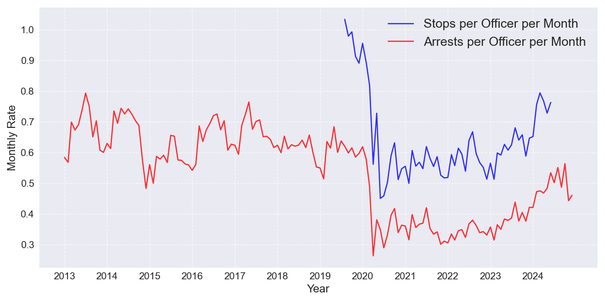

# Metropolitan Police Department Adult Arrest Trends, 2023-2024

## Background

MPD recently made its annual public release of adult arrest data, covering 19,263 arrests in 2024. This data represents the first full year of data available since Chief Smith took office in November of 2023, and reveals major changes in policing strategy over that timeframe. This report covers data for the entire city, and reports with the same data broken down for each Ward are available at http://bit.ly/4iG0Uht. 

This adult arrest data is taken from the Open Data DC website. DC resident and data scientist Taylor Terry maintains an archive of this and other DC public data at https://github.com/taylorterry3/dc-public-data. Taylor can be reached at taylor.terry@gmail.com.

### Citywide Changes in Arrest Patterns

In 2024 there were 19,263 adult arrests citywide, a +27% change from 15,223 arrests in 2023 and a +30% change from the 2021-2023 average of 14,861. The increase in arrests was concentrated in Wards 1, 7, and 8. These wards each saw more than 1,000 additional arrests, while the next biggest gain was 212 additional arrests in Ward 5.

| Ward | 2023 | 2024 | Change | Percent Change |
|------|------:|------:|--------:|---------------:|
| 1 | 1,699 | 2,820 | +1,121 | +66% |
| 2 | 1,790 | 1,916 | +126 | +7% |
| 3 | 466 | 477 | +11 | +2% |
| 4 | 1,119 | 1,296 | +177 | +16% |
| 5 | 2,414 | 2,626 | +212 | +9% |
| 6 | 1,578 | 1,723 | +145 | +9% |
| 7 | 2,798 | 4,017 | +1,219 | +44% |
| 8 | 3,359 | 4,388 | +1,029 | +31% |

Much of this increase in arrests was driven by 2,000 additional arrests for Traffic Violations, 868 for Theft, 814 for Narcotics, 743 for Liquor Law Violations. 

| Category | 2023 | 2024 | Change | Percent Change |
|----------|------:|------:|--------:|---------------:|
| Traffic Violations | 898 | 2,898 | +2,000 | +223% |
| Theft | 870 | 1,738 | +868 | +100% |
| Narcotics | 529 | 1,343 | +814 | +154% |
| Liquor Law Violations | 164 | 907 | +743 | +453% |
| All Other Categories | 12,762 | 12,377 | -385 | -3% |

\newpage

This crosstab shows the percentage change for these arrest categories by Ward from 2023 to 2024.

|Category| W1 | W2 | W3 | W4 | W5 | W6 | W7 | W8 |
|--------|---:|---:|---:|---:|---:|---:|---:|----:|
| Traffic | +108% | +45% | +106% | +80% | +129% | +137% | +1047% | +211% |
| Theft | +176% | +69% | +16% | +231% | +56% | +79% | +173% | +89% |
| Narcotics | +400% | +42% | +33% | -29% | +113% | +181% | +100% | +229% |
| Liquor | +433% | +89% | +100% | +260% | +470% | +140% | +844% | +1369% |
| Other | +23% | -10% | -7% | 0% | -13% | -11% | -10% | +4% |

### Productivity per Officer

MPD reported having 3,282 sworn officers in 2024, meaning that 19,263 arrests represents 5.9 arrests per sworn officer for the year. This is a substantial increase from the 2021-2023 average of 4.3 arrests per officer per year, but is far from a return to the 2016-2019 average of 7.7 arrests per officer. The chart below shows the trend in arrests per sworn officer over time, as well as the trend in stops per officer for periods when this data is available. (MPD stops data currently runs only through June of 2024, and the release schedule is irregular.)

\newpage
### Arrest Categories with Largest Increase 2023-2024
This table highlights the arrest categories that saw the largest percentage increases citywide from 2023 to 2024.

| Category | 2023 | 2024 | Change |
|----------|------:|------:|---------:|
| Liquor Law Violations | 164 | 907 | +453% |
| Traffic Violations | 898 | 2,898 | +223% |
| Narcotics | 529 | 1,343 | +154% |
| Theft from Auto | 14 | 30 | +114% |
| Prostitution | 10 | 20 | +100% |
| Theft | 870 | 1,738 | +100% |
| Aggravated Assault | 122 | 236 | +93% |
| Disorderly Conduct | 106 | 195 | +84% |
| Motor Vehicle Theft | 31 | 50 | +61% |
| Gambling | 5 | 7 | +40% |
| All Other Categories | 12,474 | 11,839 | -5% |
### Top Arrest Categories in 2024
The table below shows the most common types of arrests citywide during 2024, compared with 2023 counts.

| Category | 2023 | 2024 | Change |
|----------|------:|------:|---------:|
| Simple Assault | 5,002 | 4,570 | -9% |
| Traffic Violations | 898 | 2,898 | +223% |
| Theft | 870 | 1,738 | +100% |
| Release Violations/Fugitive | 1,568 | 1,610 | +3% |
| Narcotics | 529 | 1,343 | +154% |
| Weapon Violations | 1,421 | 1,286 | -10% |
| Other Crimes | 1,043 | 976 | -6% |
| Liquor Law Violations | 164 | 907 | +453% |
| Driving/Boating While Intoxicated | 606 | 604 | 0% |
| Damage to Property | 627 | 527 | -16% |
| All Other Categories | 2,495 | 2,804 | +12% |

\newpage
### Arrest Categories with Largest Increase H1-H2 2024
Many areas of the city and types of crimes saw substantial changes in the pattern of arrests between the first half and second half of 2024. The following table compares arrest counts between the first half (H1) and second half (H2) of 2024.

| Category | H1 2024 | H2 2024 | Change |
|----------|---------:|---------:|---------:|
| Vending Violations | 0 | 0 | N/A |
| nan | 0 | 0 | N/A |
| Prostitution | 7 | 13 | +86% |
| Traffic Violations | 1,137 | 1,761 | +55% |
| Motor Vehicle Theft | 21 | 29 | +38% |
| Gambling | 3 | 4 | +33% |
| Burglary | 64 | 84 | +31% |
| Liquor Law Violations | 407 | 500 | +23% |
| Narcotics | 625 | 718 | +15% |
| Theft | 849 | 889 | +5% |
| All Other Categories | 6,267 | 5,885 | -6% |

\newpage
### Arrests by Category, 2023-2024
Figure 2 below compares the distribution of arrests across different categories between 2023 and 2024 citywide. The side-by-side bars allow for easy comparison of how the composition of arrests has changed year over year.

