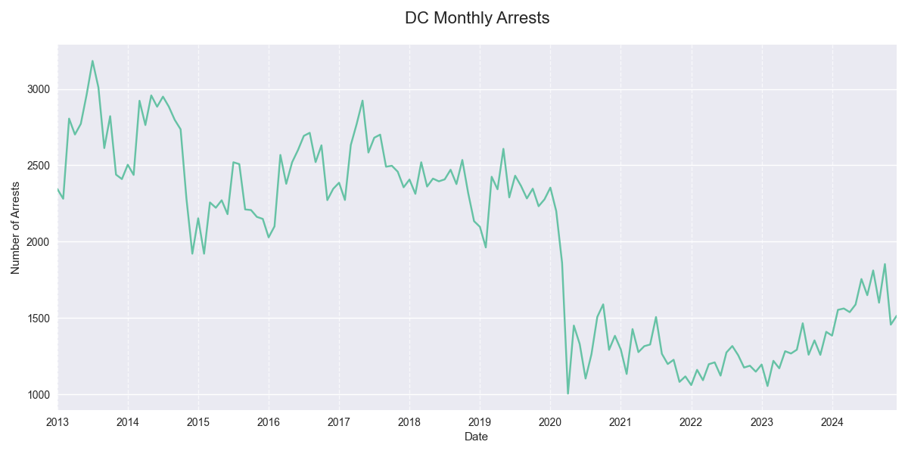
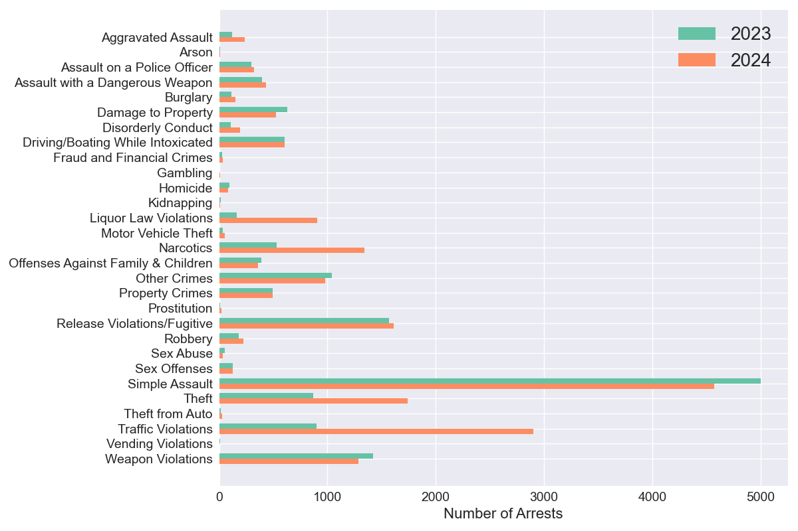

## DC MPD Adult Arrest Summary, 2023-2024

### Overview
In 2024 there were 19,263 adult arrests citywide, a +27% change from 2023 and a +30% change from the 2021-2023 average. The second half of 2024 saw 9,883 arrests, compared to 9,380 in the first half.

### Top Arrest Categories in 2024
The table below shows the most common types of arrests citywide during 2024, compared with 2023 counts.

| Category | 2023 | 2024 | Change |
|----------|------:|------:|---------:|
| Simple Assault | 5,002 | 4,570 | -9% |
| Traffic Violations | 898 | 2,898 | +223% |
| Theft | 870 | 1,738 | +100% |
| Release Violations/Fugitive | 1,568 | 1,610 | +3% |
| Narcotics | 529 | 1,343 | +154% |
| Weapon Violations | 1,421 | 1,286 | -10% |
| Other Crimes | 1,043 | 976 | -6% |
| Liquor Law Violations | 164 | 907 | +453% |
| Driving/Boating While Intoxicated | 606 | 604 | 0% |
| Damage to Property | 627 | 527 | -16% |

### Arrest Categories with Largest Increase 2023-2024
This table highlights the arrest categories that saw the largest percentage increases citywide from 2023 to 2024.

| Category | 2023 | 2024 | Change |
|----------|------:|------:|---------:|
| Liquor Law Violations | 164 | 907 | +453% |
| Traffic Violations | 898 | 2,898 | +223% |
| Narcotics | 529 | 1,343 | +154% |
| Theft from Auto | 14 | 30 | +114% |
| Prostitution | 10 | 20 | +100% |
| Theft | 870 | 1,738 | +100% |
| Aggravated Assault | 122 | 236 | +93% |
| Disorderly Conduct | 106 | 195 | +84% |
| Motor Vehicle Theft | 31 | 50 | +61% |
| Gambling | 5 | 7 | +40% |

### Arrest Categories with Largest Increase H1-H2 2024
The following table compares arrest counts between the first half (H1) and second half (H2) of 2024.

| Category | H1 2024 | H2 2024 | Change |
|----------|---------:|---------:|---------:|
| Prostitution | 7 | 13 | +86% |
| Traffic Violations | 1,137 | 1,761 | +55% |
| Motor Vehicle Theft | 21 | 29 | +38% |
| Gambling | 3 | 4 | +33% |
| Burglary | 64 | 84 | +31% |
| Liquor Law Violations | 407 | 500 | +23% |
| Narcotics | 625 | 718 | +15% |
| Theft | 849 | 889 | +5% |
| Assault on a Police Officer | 158 | 162 | +3% |
| Damage to Property | 263 | 264 | 0% |

### Monthly Trends
The line graph below shows the month-by-month pattern of total arrests citywide over time. This visualization helps identify seasonal patterns and longer-term trends in arrest volumes.

### Arrests by Category, 2023-2024
This chart compares the distribution of arrests across different categories between 2023 and 2024. The side-by-side bars allow for easy comparison of how the composition of arrests has changed year over year.

