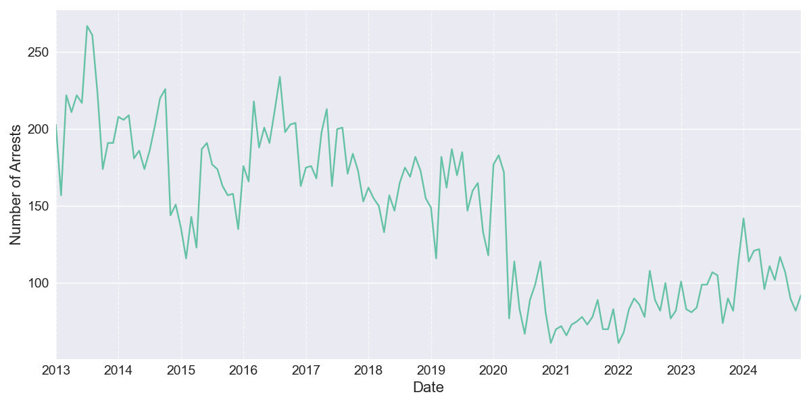

# Ward 4 MPD Adult Arrest Summary, 2023-2024

## Background

MPD recently made its annual public release of Adult Arrests data, covering 19,263 arrests in 2024. This data represents the first full year of data available since Chief Smith took office in November of 2023, and reveals major changes in policing strategy over that timeframe. This report begins with an overview of citywide trends, and then explores the data specific to Ward 4.

This adult arrest data is taken from the Open Data DC website. DC resident and data scientist Taylor Terry maintains an archive of this and other DC public data at https://github.com/taylorterry3/dc-public-data. A complete index of these reports for each Ward is available at http://bit.ly/4iG0Uht. Taylor can be reached at taylor.terry@gmail.com.

### Citywide Overview

In 2024 there were 19,263 adult arrests citywide, a +27% change from 2023 and a +30% change from the 2021-2023 average. This represents a substantial increase in arrests per sworn officer, which fell sharply after 2020 from an average of 7.7 arrests per officer per year in 2016-2019 to 4.3 in 2021-2023.

### Ward 4 Overview
In 2024 there were 1,296 adult arrests in Ward 4, a +16% change from 2023 (citywide: +27%) and a +29% change from the 2021-2023 average (citywide: +30%). The second half of 2024 saw 590 arrests, compared to 706 in the first half.

### Arrest Categories with Largest Increase 2023-2024
This table highlights the arrest categories that saw the largest percentage increases in Ward 4 from 2023 to 2024. The citywide changes are shown for comparison to help identify whether these trends are ward-specific or part of broader patterns.

| Category | 2023 | 2024 | Ward 4 Change | Citywide Change |
|----------|------:|------:|---------:|----------------:|
| Fraud and Financial Crimes | 1 | 7 | +600% | +36% |
| Disorderly Conduct | 2 | 8 | +300% | +84% |
| Liquor Law Violations | 5 | 18 | +260% | +453% |
| Theft | 35 | 116 | +231% | +100% |
| Motor Vehicle Theft | 2 | 5 | +150% | +61% |
| Traffic Violations | 122 | 220 | +80% | +223% |
| Sex Offenses | 6 | 10 | +67% | -3% |
| Burglary | 8 | 11 | +38% | +31% |
| Driving/Boating While Intoxicated | 65 | 77 | +18% | 0% |
| Robbery | 13 | 15 | +15% | +23% |
### Top Arrest Categories in 2024
The table below shows the most common types of arrests in Ward 4 during 2024, compared with 2023 counts. For each category, the ward-specific and citywide percentage changes are shown to provide context.

| Category | 2023 | 2024 | Ward 4 Change | Citywide Change |
|----------|------:|------:|---------:|----------------:|
| Simple Assault | 360 | 370 | +3% | -9% |
| Traffic Violations | 122 | 220 | +80% | +223% |
| Release Violations/Fugitive | 121 | 136 | +12% | +3% |
| Theft | 35 | 116 | +231% | +100% |
| Driving/Boating While Intoxicated | 65 | 77 | +18% | 0% |
| Other Crimes | 88 | 74 | -16% | -6% |
| Weapon Violations | 76 | 50 | -34% | -10% |
| Damage to Property | 49 | 39 | -20% | -16% |
| Narcotics | 48 | 34 | -29% | +154% |
| Property Crimes | 29 | 33 | +14% | 0% |

### Arrest Categories with Largest Increase H1-H2 2024
The following table compares arrest counts between the first half (H1) and second half (H2) of 2024 in Ward 4. This comparison helps identify emerging trends within the year. Categories are sorted by the magnitude of change between halves.

| Category | H1 2024 | H2 2024 | Ward 4 Change | Citywide Change |
|----------|---------:|---------:|---------:|----------------:|
| Sex Abuse | 0 | 1 | N/A | -48% |
| Homicide | 0 | 1 | N/A | -7% |
| Disorderly Conduct | 2 | 6 | +200% | -14% |
| Sex Offenses | 3 | 7 | +133% | -23% |
| Assault with a Dangerous Weapon | 10 | 14 | +40% | -3% |
| Aggravated Assault | 5 | 6 | +20% | -7% |
| Simple Assault | 170 | 200 | +18% | -1% |
| Damage to Property | 18 | 21 | +17% | 0% |
| Property Crimes | 16 | 17 | +6% | -10% |
| Kidnapping | 0 | 0 | 0% | 0% |

\newpage
### Monthly Trends
Figure 1 below shows the month-by-month pattern of total arrests in Ward 4 over time. This visualization helps identify seasonal patterns and longer-term trends in arrest volumes. Note that all arrest locations are based on current ward boundaries.

\newpage
### Arrests by Category, 2023-2024
Figure 2 below compares the distribution of arrests across different categories between 2023 and 2024 in Ward 4. The side-by-side bars allow for easy comparison of how the composition of arrests has changed year over year.

