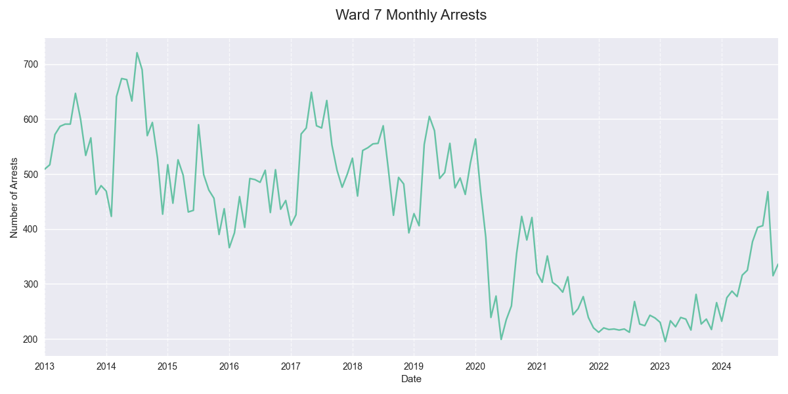

# Ward 7 MPD Adult Arrest Summary, 2023-2024

## Background

MPD recently made its annual public release of adult arrest data, covering 19,263 arrests in 2024. This data represents the first full year of data available since Chief Smith took office in November of 2023, and reveals major changes in policing strategy over that timeframe. This report begins with an overview of citywide trends, and then explores the data specific to Ward 7.

This adult arrest data is taken from the Open Data DC website. DC resident and data scientist Taylor Terry maintains an archive of this and other DC public data at https://github.com/taylorterry3/dc-public-data. A complete index of these reports for each Ward is available at http://bit.ly/4iG0Uht. Taylor can be reached at taylor.terry@gmail.com.

### Citywide Overview

In 2024 there were 19,263 adult arrests citywide, a +27% change from 2023 and a +30% change from the 2021-2023 average. 

### Ward 7 Overview

In 2024 there were 4,017 adult arrests in Ward 7, a +44% change from 2023 (citywide: +27%) and a +35% change from the 2021-2023 average (citywide: +30%). The second half of 2024 saw 2,305 arrests, compared to 1,712 in the first half.

### Arrest Categories with Largest Increase 2023-2024
This table highlights the arrest categories that saw the largest percentage increases in Ward 7 from 2023 to 2024. The citywide changes are shown for comparison to help identify whether these trends are ward-specific or part of broader patterns.

| Category | 2023 | 2024 | Ward 7 Change | Citywide Change |
|----------|------:|------:|---------:|----------------:|
| Traffic Violations | 100 | 1,147 | +1047% | +223% |
| Liquor Law Violations | 27 | 255 | +844% | +453% |
| Disorderly Conduct | 3 | 12 | +300% | +84% |
| Fraud and Financial Crimes | 1 | 4 | +300% | +36% |
| Theft | 52 | 142 | +173% | +100% |
| Narcotics | 96 | 192 | +100% | +154% |
| Aggravated Assault | 15 | 28 | +87% | +93% |
| Burglary | 17 | 28 | +65% | +31% |
| Assault with a Dangerous Weapon | 104 | 130 | +25% | +9% |
| Motor Vehicle Theft | 4 | 5 | +25% | +61% |
### Top Arrest Categories in 2024
The table below shows the most common types of arrests in Ward 7 during 2024, compared with 2023 counts. For each category, the ward-specific and citywide percentage changes are shown to provide context.

| Category | 2023 | 2024 | Ward 7 Change | Citywide Change |
|----------|------:|------:|---------:|----------------:|
| Traffic Violations | 100 | 1,147 | +1047% | +223% |
| Simple Assault | 957 | 844 | -12% | -9% |
| Release Violations/Fugitive | 388 | 402 | +4% | +3% |
| Weapon Violations | 364 | 263 | -28% | -10% |
| Liquor Law Violations | 27 | 255 | +844% | +453% |
| Narcotics | 96 | 192 | +100% | +154% |
| Theft | 52 | 142 | +173% | +100% |
| Assault with a Dangerous Weapon | 104 | 130 | +25% | +9% |
| Property Crimes | 124 | 117 | -6% | 0% |
| Damage to Property | 125 | 99 | -21% | -16% |

### Arrest Categories with Largest Increase H1-H2 2024
Many areas of the city and types of crimes saw substantial changes in the pattern of arrests between the first half and second half of 2024. The following table compares arrest counts between the first half (H1) and second half (H2) of 2024 in Ward 7. This comparison helps identify emerging trends within the year. Categories are sorted by the magnitude of change between halves.

| Category | H1 2024 | H2 2024 | Ward 7 Change | Citywide Change |
|----------|---------:|---------:|---------:|----------------:|
| Traffic Violations | 273 | 874 | +220% | +55% |
| Other Crimes | 33 | 64 | +94% | 0% |
| Liquor Law Violations | 95 | 160 | +68% | +23% |
| Assault on a Police Officer | 14 | 21 | +50% | +3% |
| Assault with a Dangerous Weapon | 58 | 72 | +24% | -3% |
| Offenses Against Family & Children | 34 | 38 | +12% | -16% |
| Narcotics | 92 | 100 | +9% | +15% |
| Property Crimes | 58 | 59 | +2% | -10% |
| Prostitution | 0 | 0 | 0% | +86% |
| Aggravated Assault | 14 | 14 | 0% | -7% |

\newpage
### Monthly Trends
Figure 1 below shows the month-by-month pattern of total arrests in Ward 7 over time. This visualization helps identify seasonal patterns and longer-term trends in arrest volumes. Note that all arrest locations are based on current ward boundaries.

\newpage
### Arrests by Category, 2023-2024
Figure 2 below compares the distribution of arrests across different categories between 2023 and 2024 in Ward 7. The side-by-side bars allow for easy comparison of how the composition of arrests has changed year over year.

