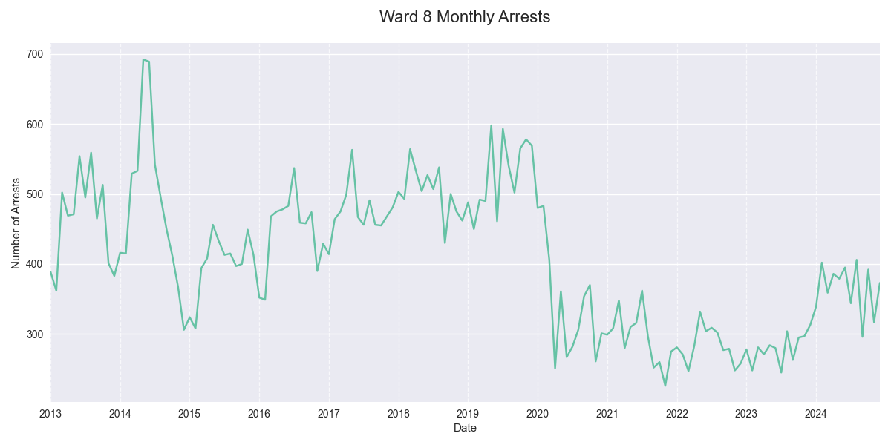
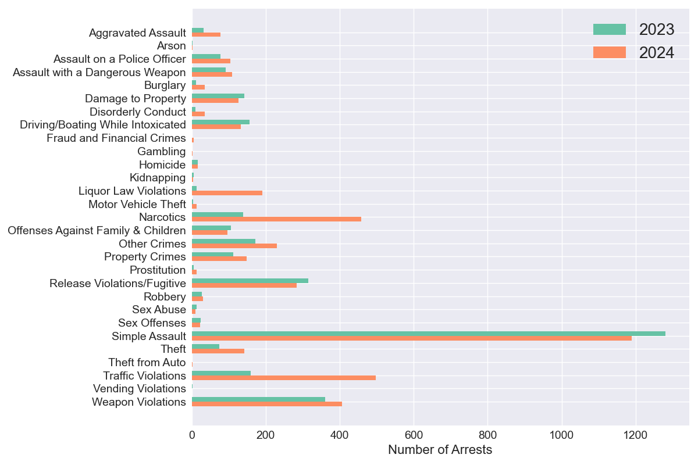

## Ward 8 MPD Adult Arrest Summary, 2023-2024

### Overview
In 2024 there were 4,388 adult arrests in Ward 8, a +31% change from 2023 (citywide: +27%) and a +28% change from the 2021-2023 average (citywide: +30%). The second half of 2024 saw 2,128 arrests, compared to 2,260 in the first half.

### Top Arrest Categories in 2024
The table below shows the most common types of arrests in Ward 8 during 2024, compared with 2023 counts. For each category, the ward-specific and citywide percentage changes are shown to provide context.

| Category | 2023 | 2024 | Ward 8 Change | Citywide Change |
|----------|------:|------:|---------:|----------------:|
| Simple Assault | 1,281 | 1,190 | -7% | -9% |
| Traffic Violations | 160 | 497 | +211% | +223% |
| Narcotics | 139 | 458 | +229% | +154% |
| Weapon Violations | 361 | 407 | +13% | -10% |
| Release Violations/Fugitive | 315 | 284 | -10% | +3% |
| Other Crimes | 172 | 231 | +34% | -6% |
| Liquor Law Violations | 13 | 191 | +1369% | +453% |
| Property Crimes | 113 | 148 | +31% | 0% |
| Theft | 75 | 142 | +89% | +100% |
| Driving/Boating While Intoxicated | 156 | 133 | -15% | 0% |

### Arrest Categories with Largest Increase 2023-2024
This table highlights the arrest categories that saw the largest percentage increases in Ward 8 from 2023 to 2024. The citywide changes are shown for comparison to help identify whether these trends are ward-specific or part of broader patterns.

| Category | 2023 | 2024 | Ward 8 Change | Citywide Change |
|----------|------:|------:|---------:|----------------:|
| Liquor Law Violations | 13 | 191 | +1369% | +453% |
| Fraud and Financial Crimes | 1 | 5 | +400% | +36% |
| Disorderly Conduct | 10 | 36 | +260% | +84% |
| Motor Vehicle Theft | 4 | 14 | +250% | +61% |
| Narcotics | 139 | 458 | +229% | +154% |
| Traffic Violations | 160 | 497 | +211% | +223% |
| Burglary | 12 | 36 | +200% | +31% |
| Theft from Auto | 1 | 3 | +200% | +114% |
| Prostitution | 5 | 13 | +160% | +100% |
| Aggravated Assault | 32 | 78 | +144% | +93% |

### Arrest Categories with Largest Increase H1-H2 2024
The following table compares arrest counts between the first half (H1) and second half (H2) of 2024 in Ward 8. This comparison helps identify emerging trends within the year. Categories are sorted by the magnitude of change between halves.

| Category | H1 2024 | H2 2024 | Ward 8 Change | Citywide Change |
|----------|---------:|---------:|---------:|----------------:|
| Prostitution | 1 | 12 | +1100% | +86% |
| Theft from Auto | 1 | 2 | +100% | -24% |
| Burglary | 14 | 22 | +57% | +31% |
| Disorderly Conduct | 15 | 21 | +40% | -14% |
| Driving/Boating While Intoxicated | 57 | 76 | +33% | -5% |
| Motor Vehicle Theft | 6 | 8 | +33% | +38% |
| Theft | 63 | 79 | +25% | +5% |
| Property Crimes | 67 | 81 | +21% | -10% |
| Traffic Violations | 234 | 263 | +12% | +55% |
| Aggravated Assault | 37 | 41 | +11% | -7% |

### Monthly Trends
The line graph below shows the month-by-month pattern of total arrests in Ward 8 over time. This visualization helps identify seasonal patterns and longer-term trends in arrest volumes. Note that all arrest locations are based on current ward boundaries.

### Arrests by Category, 2023-2024
This chart compares the distribution of arrests across different categories between 2023 and 2024 in Ward 8. The side-by-side bars allow for easy comparison of how the composition of arrests has changed year over year.

