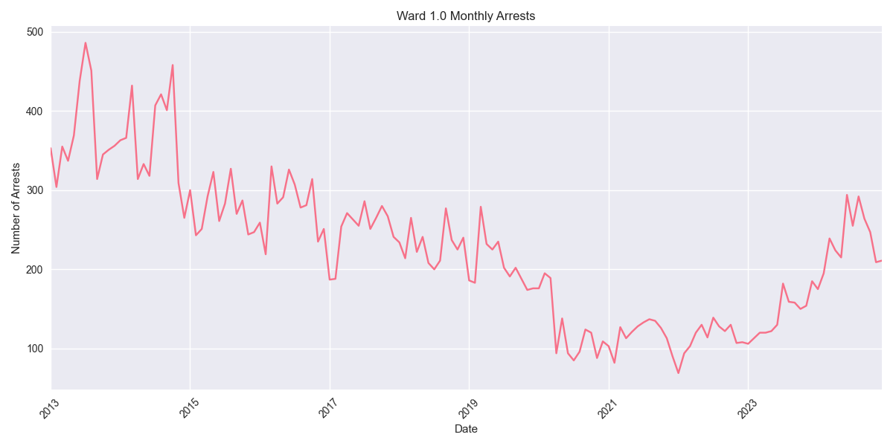
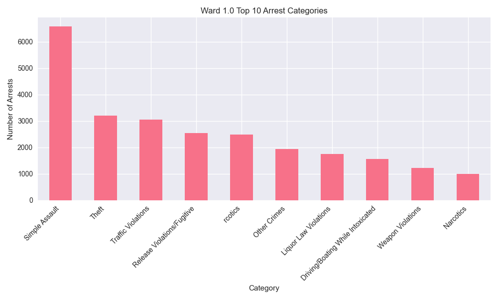

# Ward 1.0 Arrest Analysis Report

## Overview
Ward 1.0 has recorded 32,602 total arrests since 2013. In the past year (2023-2024), there have been 4,519 arrests in this ward.

## Key Statistics
- Total Arrests: 32,602
- Recent Arrests (2023-2024): 4,519
- Average Annual Arrests: 2717

## Top Arrest Categories
- Simple Assault: 6,586 arrests
- Theft: 3,204 arrests
- Traffic Violations: 3,053 arrests
- Release Violations/Fugitive: 2,552 arrests
-  rcotics: 2,480 arrests

## Monthly Trends

## Category Distribution

## Analysis
Ward 1.0 has seen an increase in arrest activity in recent years, with 4,519 arrests in 2023-2024 compared to an average of 2717 arrests per year.
The most common arrest category in this ward is Simple Assault, with 6,586 arrests.
