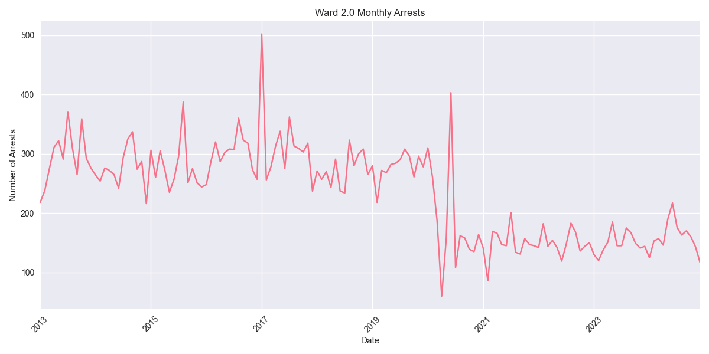
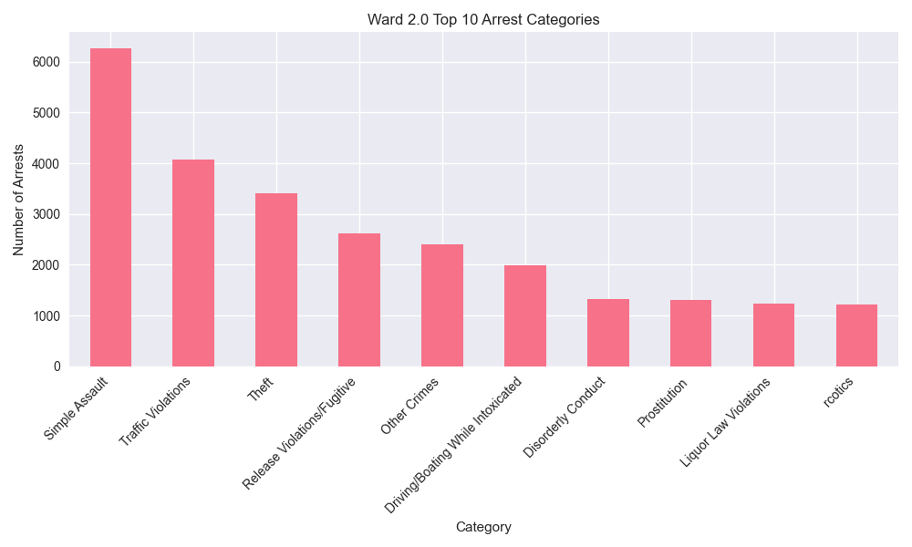

# Ward 2.0 Arrest Analysis Report

## Overview
Ward 2.0 has recorded 33,711 total arrests since 2013. In the past year (2023-2024), there have been 3,706 arrests in this ward.

## Key Statistics
- Total Arrests: 33,711
- Recent Arrests (2023-2024): 3,706
- Average Annual Arrests: 2809

## Top Arrest Categories
- Simple Assault: 6,269 arrests
- Traffic Violations: 4,072 arrests
- Theft: 3,413 arrests
- Release Violations/Fugitive: 2,628 arrests
- Other Crimes: 2,403 arrests

## Monthly Trends

## Category Distribution

## Analysis
Ward 2.0 has seen an increase in arrest activity in recent years, with 3,706 arrests in 2023-2024 compared to an average of 2809 arrests per year.
The most common arrest category in this ward is Simple Assault, with 6,269 arrests.
