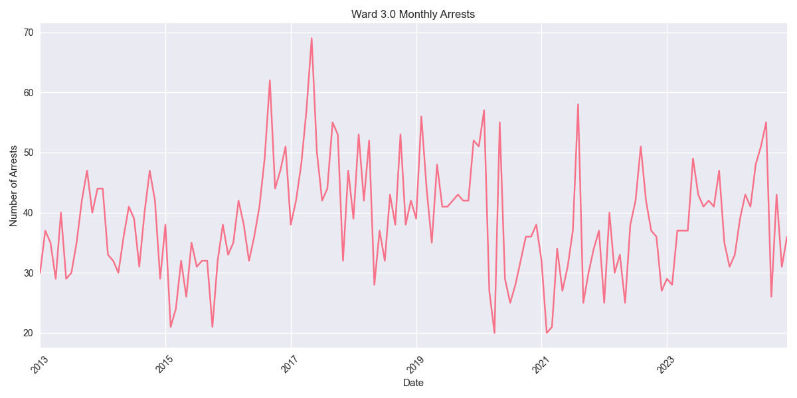
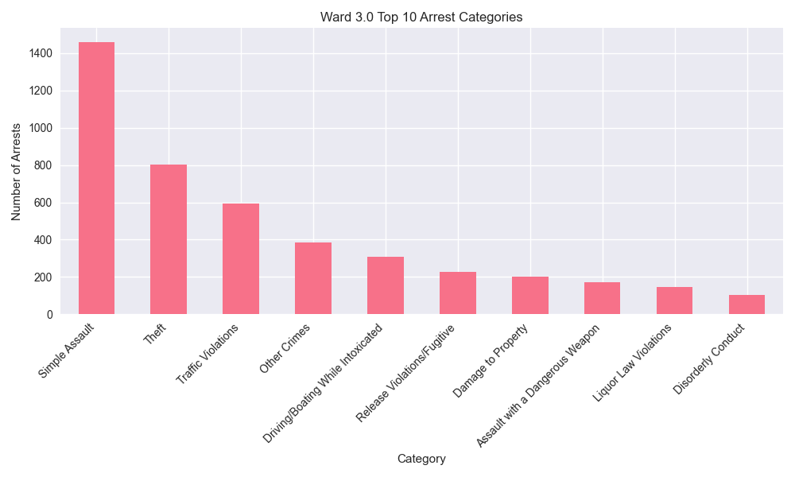

# Ward 3.0 Arrest Analysis Report

## Overview
Ward 3.0 has recorded 5,542 total arrests since 2013. In the past year (2023-2024), there have been 943 arrests in this ward.

## Key Statistics
- Total Arrests: 5,542
- Recent Arrests (2023-2024): 943
- Average Annual Arrests: 462

## Top Arrest Categories
- Simple Assault: 1,460 arrests
- Theft: 801 arrests
- Traffic Violations: 592 arrests
- Other Crimes: 385 arrests
- Driving/Boating While Intoxicated: 308 arrests

## Monthly Trends

## Category Distribution

## Analysis
Ward 3.0 has seen an increase in arrest activity in recent years, with 943 arrests in 2023-2024 compared to an average of 462 arrests per year.
The most common arrest category in this ward is Simple Assault, with 1,460 arrests.
