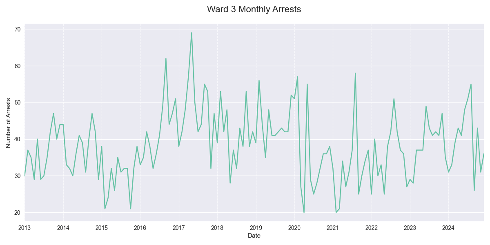
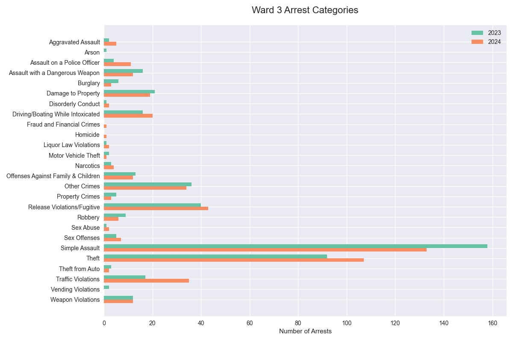

## Ward 3 MPD Adult Arrest Summary, 2023-2024

### Overview
In 2024 there were 477 adult arrests in Ward 3, a +2% change from 2023 and a +12% change from the 2021-2023 average. The second half of 2024 saw 242 arrests, compared to 235 in the first half.

### Top Arrest Categories in 2024
| Category | 2023 | 2024 | Change |
|----------|------:|------:|---------:|
| Simple Assault | 158 | 133 | -16% |
| Theft | 92 | 107 | +16% |
| Release Violations/Fugitive | 40 | 43 | +8% |
| Traffic Violations | 17 | 35 | +106% |
| Other Crimes | 36 | 34 | -6% |

### Arrest Categories with Largest Increase 2023-2024
| Category | 2023 | 2024 | Change |
|----------|------:|------:|---------:|
| Assault on a Police Officer | 4 | 11 | +175% |
| Aggravated Assault | 2 | 5 | +150% |
| Traffic Violations | 17 | 35 | +106% |
| Sex Abuse | 1 | 2 | +100% |
| Disorderly Conduct | 1 | 2 | +100% |

### Arrest Categories with Largest Increase H1-H2 2024
| Category | H1 2024 | H2 2024 | Change |
|----------|---------:|---------:|---------:|
| Driving/Boating While Intoxicated | 5 | 15 | +200% |
| Burglary | 1 | 2 | +100% |
| Property Crimes | 1 | 2 | +100% |
| Aggravated Assault | 2 | 3 | +50% |
| Assault with a Dangerous Weapon | 5 | 7 | +40% |

### Monthly Trends

### Arrests by Category, 2023-2024

