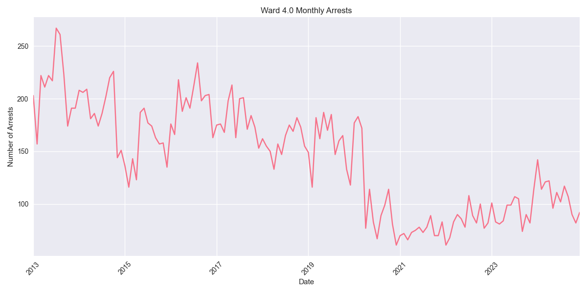
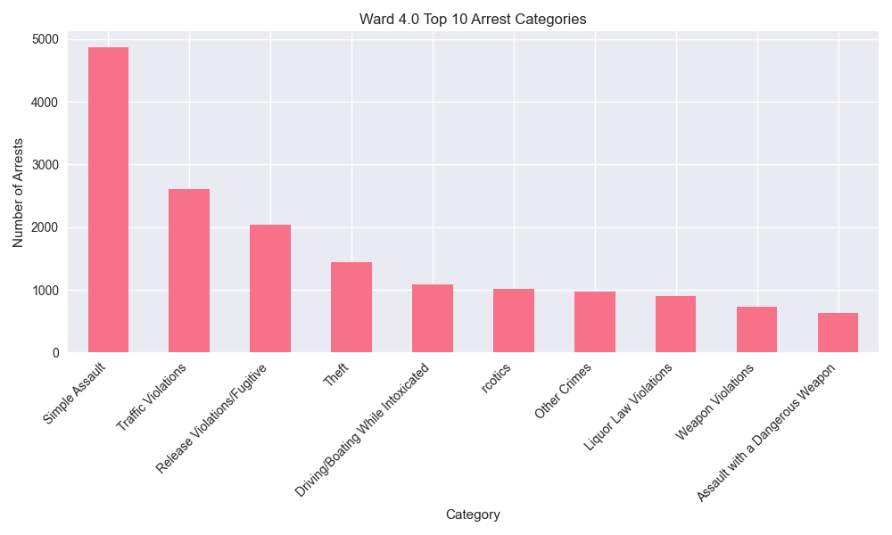

# Ward 4.0 Arrest Analysis Report

## Overview
Ward 4.0 has recorded 20,651 total arrests since 2013. In the past year (2023-2024), there have been 2,415 arrests in this ward.

## Key Statistics
- Total Arrests: 20,651
- Recent Arrests (2023-2024): 2,415
- Average Annual Arrests: 1721

## Top Arrest Categories
- Simple Assault: 4,874 arrests
- Traffic Violations: 2,602 arrests
- Release Violations/Fugitive: 2,034 arrests
- Theft: 1,444 arrests
- Driving/Boating While Intoxicated: 1,086 arrests

## Monthly Trends

## Category Distribution

## Analysis
Ward 4.0 has seen an increase in arrest activity in recent years, with 2,415 arrests in 2023-2024 compared to an average of 1721 arrests per year.
The most common arrest category in this ward is Simple Assault, with 4,874 arrests.
