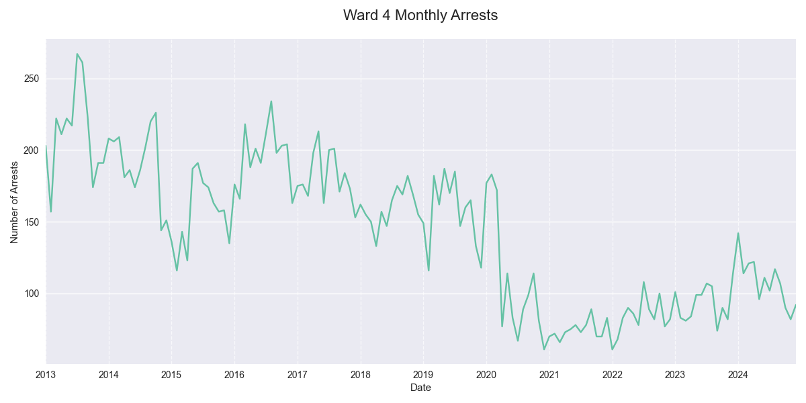
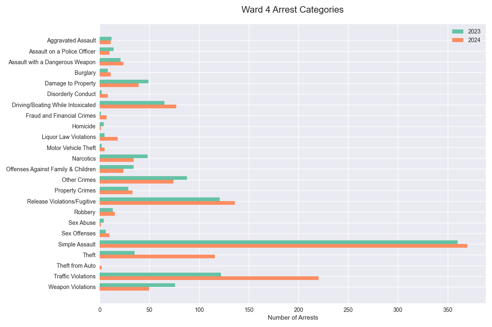

## Ward 4 MPD Adult Arrest Summary, 2023-2024

### Overview
In 2024 there were 1,296 adult arrests in Ward 4, a +16% change from 2023 and a +29% change from the 2021-2023 average. The second half of 2024 saw 590 arrests, compared to 706 in the first half.

### Top Arrest Categories in 2024
| Category | 2023 | 2024 | Change |
|----------|------:|------:|---------:|
| Simple Assault | 360 | 370 | +3% |
| Traffic Violations | 122 | 220 | +80% |
| Release Violations/Fugitive | 121 | 136 | +12% |
| Theft | 35 | 116 | +231% |
| Driving/Boating While Intoxicated | 65 | 77 | +18% |

### Arrest Categories with Largest Increase 2023-2024
| Category | 2023 | 2024 | Change |
|----------|------:|------:|---------:|
| Fraud and Financial Crimes | 1 | 7 | +600% |
| Disorderly Conduct | 2 | 8 | +300% |
| Liquor Law Violations | 5 | 18 | +260% |
| Theft | 35 | 116 | +231% |
| Motor Vehicle Theft | 2 | 5 | +150% |

### Arrest Categories with Largest Increase H1-H2 2024
| Category | H1 2024 | H2 2024 | Change |
|----------|---------:|---------:|---------:|
| Disorderly Conduct | 2 | 6 | +200% |
| Sex Offenses | 3 | 7 | +133% |
| Assault with a Dangerous Weapon | 10 | 14 | +40% |
| Aggravated Assault | 5 | 6 | +20% |
| Simple Assault | 170 | 200 | +18% |

### Monthly Trends

### Arrests by Category, 2023-2024

