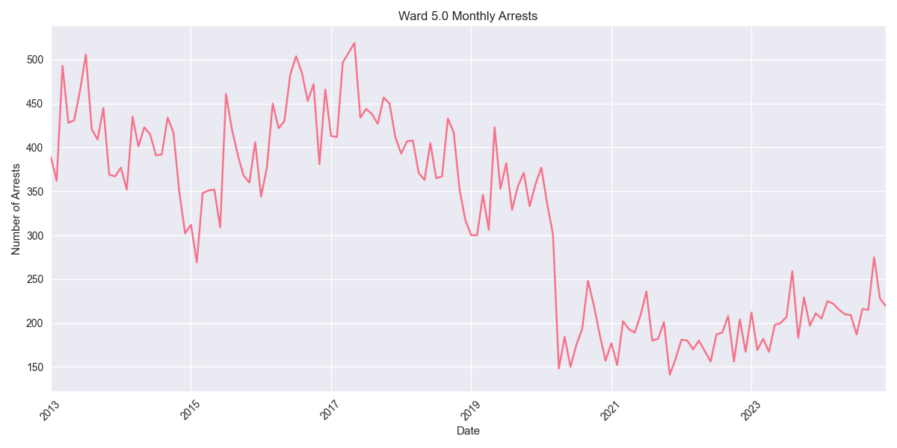
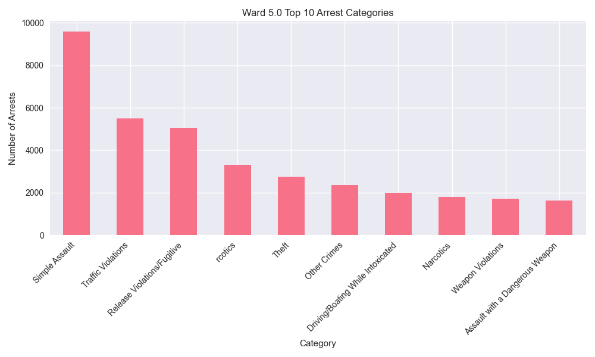

# Ward 5.0 Arrest Analysis Report

## Overview
Ward 5.0 has recorded 45,638 total arrests since 2013. In the past year (2023-2024), there have been 5,040 arrests in this ward.

## Key Statistics
- Total Arrests: 45,638
- Recent Arrests (2023-2024): 5,040
- Average Annual Arrests: 3803

## Top Arrest Categories
- Simple Assault: 9,595 arrests
- Traffic Violations: 5,493 arrests
- Release Violations/Fugitive: 5,060 arrests
-  rcotics: 3,301 arrests
- Theft: 2,751 arrests

## Monthly Trends

## Category Distribution

## Analysis
Ward 5.0 has seen an increase in arrest activity in recent years, with 5,040 arrests in 2023-2024 compared to an average of 3803 arrests per year.
The most common arrest category in this ward is Simple Assault, with 9,595 arrests.
