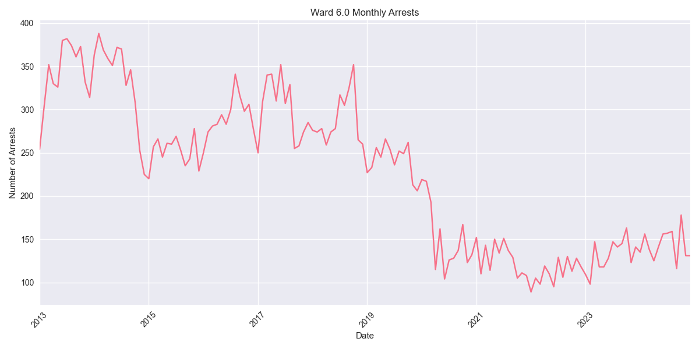
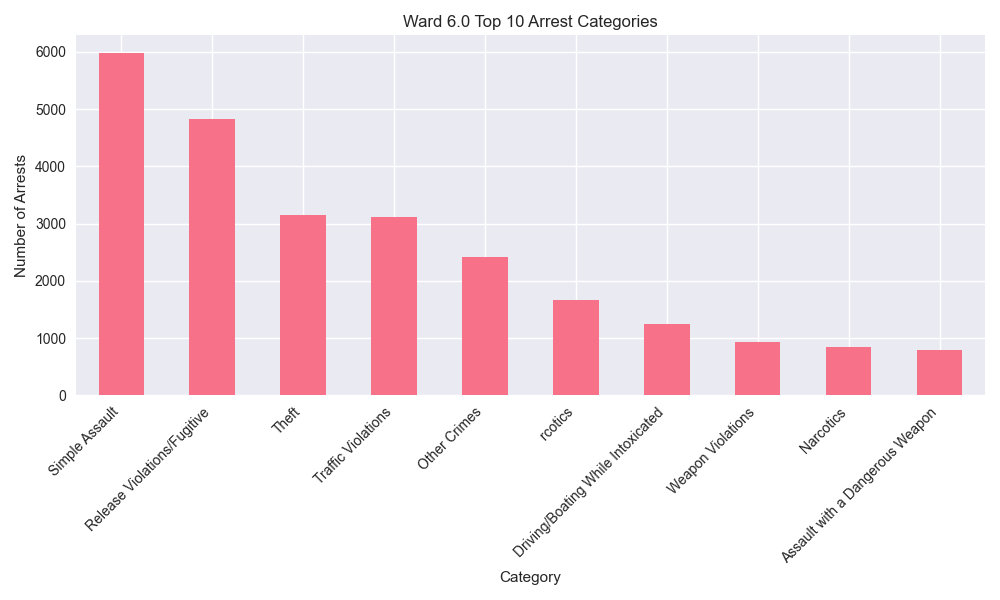

# Ward 6.0 Arrest Analysis Report

## Overview
Ward 6.0 has recorded 32,613 total arrests since 2013. In the past year (2023-2024), there have been 3,301 arrests in this ward.

## Key Statistics
- Total Arrests: 32,613
- Recent Arrests (2023-2024): 3,301
- Average Annual Arrests: 2718

## Top Arrest Categories
- Simple Assault: 5,986 arrests
- Release Violations/Fugitive: 4,828 arrests
- Theft: 3,151 arrests
- Traffic Violations: 3,114 arrests
- Other Crimes: 2,416 arrests

## Monthly Trends

## Category Distribution

## Analysis
Ward 6.0 has seen an increase in arrest activity in recent years, with 3,301 arrests in 2023-2024 compared to an average of 2718 arrests per year.
The most common arrest category in this ward is Simple Assault, with 5,986 arrests.
