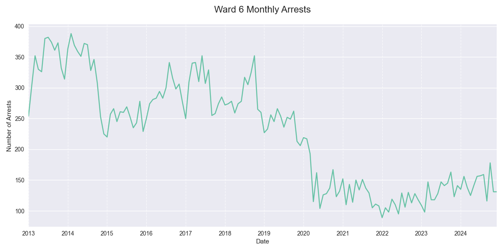
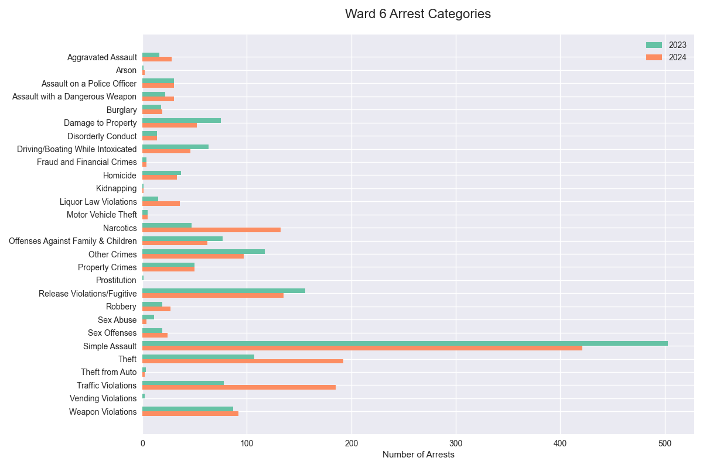

## Ward 6 MPD Adult Arrest Summary, 2023-2024

### Overview
In 2024 there were 1,723 adult arrests in Ward 6, a +9% change from 2023 and a +16% change from the 2021-2023 average. The second half of 2024 saw 872 arrests, compared to 851 in the first half.

### Top Arrest Categories in 2024
| Category | 2023 | 2024 | Change |
|----------|------:|------:|---------:|
| Simple Assault | 503 | 421 | -16% |
| Theft | 107 | 192 | +79% |
| Traffic Violations | 78 | 185 | +137% |
| Release Violations/Fugitive | 156 | 135 | -13% |
| Narcotics | 47 | 132 | +181% |

### Arrest Categories with Largest Increase 2023-2024
| Category | 2023 | 2024 | Change |
|----------|------:|------:|---------:|
| Narcotics | 47 | 132 | +181% |
| Liquor Law Violations | 15 | 36 | +140% |
| Traffic Violations | 78 | 185 | +137% |
| Arson | 1 | 2 | +100% |
| Theft | 107 | 192 | +79% |

### Arrest Categories with Largest Increase H1-H2 2024
| Category | H1 2024 | H2 2024 | Change |
|----------|---------:|---------:|---------:|
| Motor Vehicle Theft | 1 | 4 | +300% |
| Burglary | 5 | 14 | +180% |
| Liquor Law Violations | 13 | 23 | +77% |
| Homicide | 12 | 21 | +75% |
| Other Crimes | 37 | 60 | +62% |

### Monthly Trends

### Arrests by Category, 2023-2024

