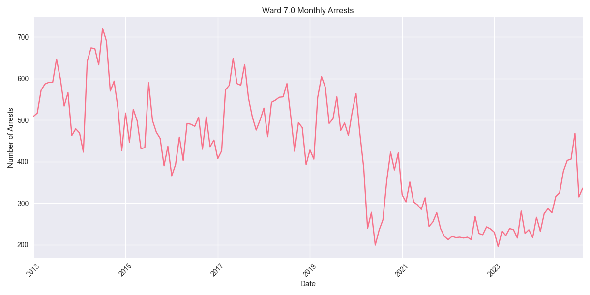
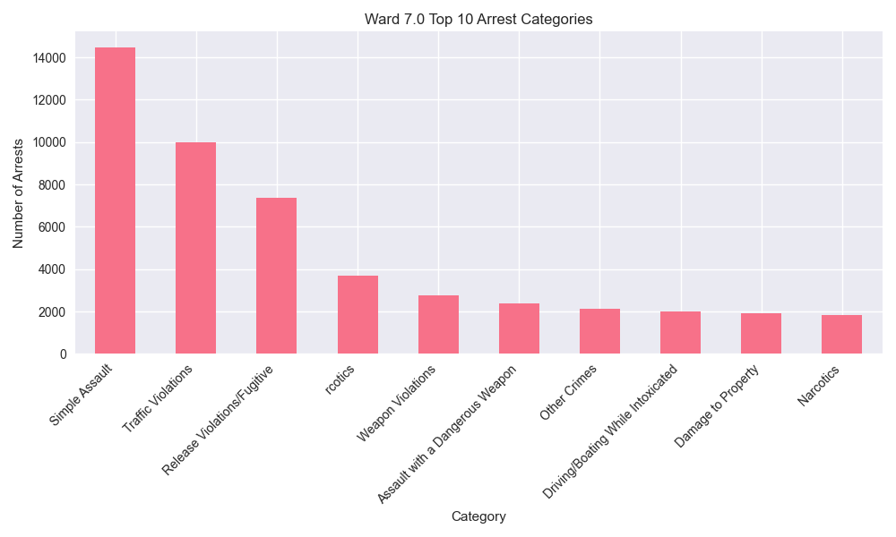

# Ward 7.0 Arrest Analysis Report

## Overview
Ward 7.0 has recorded 60,594 total arrests since 2013. In the past year (2023-2024), there have been 6,815 arrests in this ward.

## Key Statistics
- Total Arrests: 60,594
- Recent Arrests (2023-2024): 6,815
- Average Annual Arrests: 5050

## Top Arrest Categories
- Simple Assault: 14,487 arrests
- Traffic Violations: 10,007 arrests
- Release Violations/Fugitive: 7,366 arrests
-  rcotics: 3,678 arrests
- Weapon Violations: 2,781 arrests

## Monthly Trends

## Category Distribution

## Analysis
Ward 7.0 has seen an increase in arrest activity in recent years, with 6,815 arrests in 2023-2024 compared to an average of 5050 arrests per year.
The most common arrest category in this ward is Simple Assault, with 14,487 arrests.
