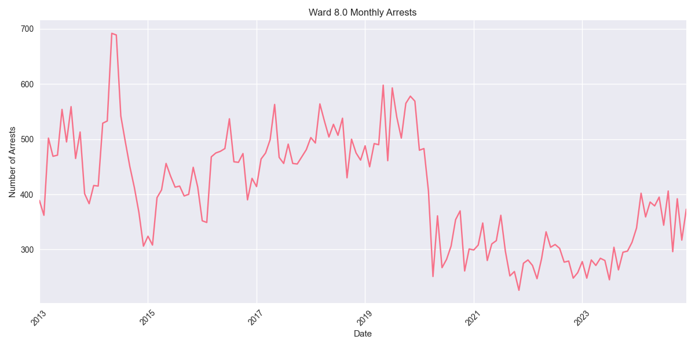
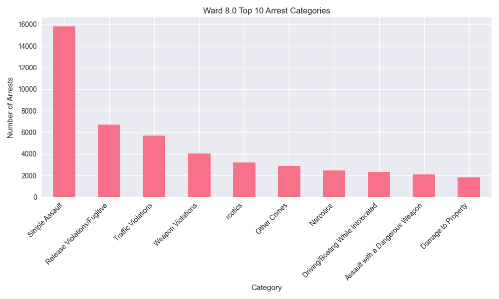

# Ward 8.0 Arrest Analysis Report

## Overview
Ward 8.0 has recorded 58,415 total arrests since 2013. In the past year (2023-2024), there have been 7,747 arrests in this ward.

## Key Statistics
- Total Arrests: 58,415
- Recent Arrests (2023-2024): 7,747
- Average Annual Arrests: 4868

## Top Arrest Categories
- Simple Assault: 15,830 arrests
- Release Violations/Fugitive: 6,701 arrests
- Traffic Violations: 5,685 arrests
- Weapon Violations: 4,018 arrests
-  rcotics: 3,197 arrests

## Monthly Trends

## Category Distribution

## Analysis
Ward 8.0 has seen an increase in arrest activity in recent years, with 7,747 arrests in 2023-2024 compared to an average of 4868 arrests per year.
The most common arrest category in this ward is Simple Assault, with 15,830 arrests.
